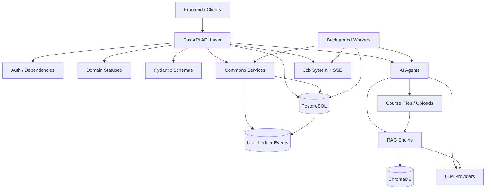
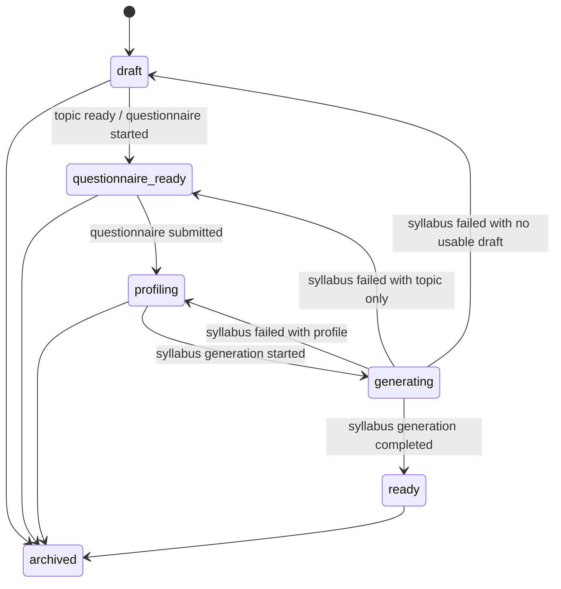
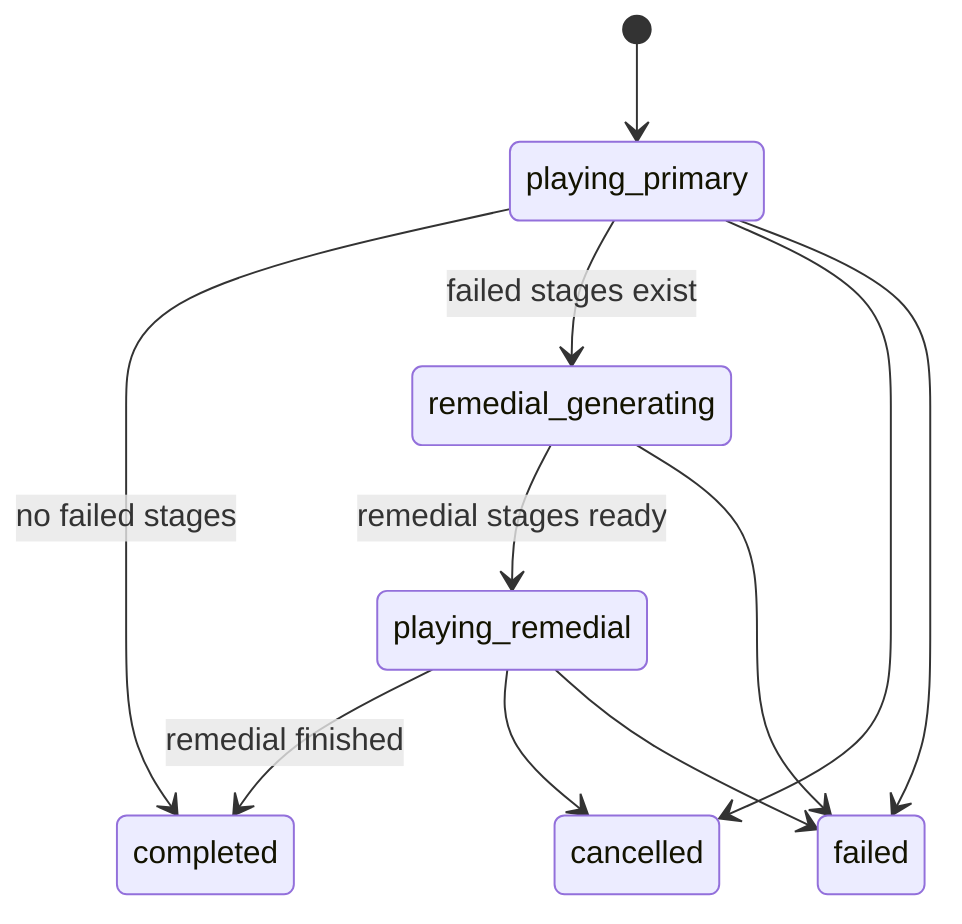
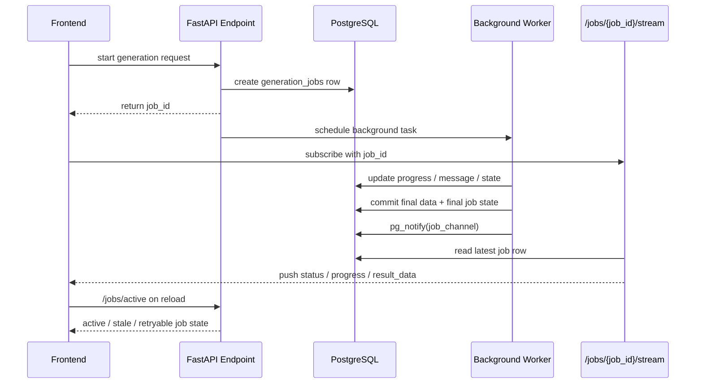

# Learn8 Backend Docs

這份文件以目前 `backend/app/` 與 `backend/alembic/` 的實作為準，整理 Learn8 後端的架構、資料模型、核心流程、AI / RAG 能力、背景任務、帳務 / XP 系統、Arena 多人競技子系統、測試策略與維運注意事項。

這份文件的目標不是只列檔名，而是讓你在三種情境都能直接使用：

- 新加入專案時快速理解後端主幹
- 開功能或修 bug 時知道該改哪一層
- 維運與排查問題時知道狀態是怎麼流動的

## How To Use This Doc

這份文件很長，建議不要從頭硬讀完，而是依目的跳讀。

### 如果你是第一次接手後端

建議閱讀順序：

1. `4. Application Entry Points`
2. `6. Domain Status System`
3. `7. Data Model Reference`
4. `9. Course Lifecycle`
5. `10. Lesson Session Lifecycle`
6. `11. Background Job System`
7. `13. AI Architecture`
8. `21. Testing Strategy`

### 如果你正在改商業邏輯

優先看：

- `8. Economy / XP / Ledger System`
- `9. Course Lifecycle`
- `10. Lesson Session Lifecycle`
- `25. Recommended Change Patterns`

### 如果你在排查 production-like 問題

優先看：

- `11. Background Job System`
- `12. SSE / Active Job Recovery`
- `24. Operational Debug Checklist`

## Quick Index

- `1.` Backend Role
- `2.` Tech Stack
- `3.` High-Level Architecture
- `4.` Application Entry Points
- `5.` Core Domain Concepts
- `6.` Domain Status System
- `7.` Data Model Reference
- `8.` Economy / XP / Ledger System
- `9.` Course Lifecycle
- `10.` Lesson Session Lifecycle
- `11.` Background Job System
- `12.` SSE / Active Job Recovery
- `13.` AI Architecture
- `14.` RAG / Knowledge Base
- `15.` File / Upload Scope
- `16.` Component Registry
- `17.` API Module Reference
- `18.` Security Notes
- `19.` Configuration Reference
- `20.` Migration Strategy
- `21.` Testing Strategy
- `22.` CI Strategy
- `23.` Frontend Contract Notes For Backend Devs
- `24.` Operational Debug Checklist
- `25.` Recommended Change Patterns
- `26.` Current Maturity Assessment
- `27.` Quick Start For Backend Contributors
- `28.` Final Notes

## Reading Map

不同任務可直接跳這些章節：

- 想知道這個後端「在做什麼」：`1`, `3`, `5`
- 想知道資料跟狀態怎麼流：`6`, `7`, `9`, `10`
- 想知道生成流程怎麼跑：`11`, `12`, `13`, `14`
- 想知道帳務與 XP：`8`, `17`, `24`
- 想知道怎麼安全改功能：`20`, `21`, `22`, `25`

---

## 1. Backend Role

Learn8 後端目前負責以下責任：

- 使用者認證、登入、安全限制、密碼重設
- 使用者 profile、credits、XP、level、ledger
- Arena 官方主題、題池、私人房、即時競賽、排行榜、season、管理台資料
- course draft CRUD
- course file 管理
- 文件解析、切 chunk、RAG ingest
- questionnaire generation / submission
- learner profile summary
- syllabus generation / refine
- lesson generation
- lesson session / attempt / failed stage persistence
- remedial generation
- Feynman grading
- lesson chat tutor
- background job 狀態追蹤
- SSE 即時推播
- active job recovery / stale / retry / cancel

目前後端不是單純 CRUD API，而是一個帶有：

- domain lifecycle
- async generation job
- AI orchestration
- ledger-backed economy

的產品型系統。

---

## 2. Tech Stack

### Runtime / Framework

- FastAPI
- SQLAlchemy 2
- Pydantic 2
- Alembic

### Data / Infra

- PostgreSQL
- ChromaDB
- PostgreSQL `LISTEN/NOTIFY`
- SSE

### AI / Retrieval

- Google Gemini
- LMStudio
- LangChain
- LangGraph

### Testing / CI

- `pytest`
- fake LLM / fake RAG test fixtures
- GitHub Actions CI

---

## 3. High-Level Architecture

目前後端結構主幹如下：

```text
backend/
  app/
    api/
    core/
    db/
    domain/
    models/
    schemas/
    services/
      arena/
      ai_agents/
      commons/
      knowledge_base/
      llm_clients/
      workers/
      workflows/
  alembic/
  tests/
```

### Backend Architecture Diagram



### 分層責任

### Arena Subsystem Snapshot

Arena 現在已經是後端中的正式子系統，不再只是計劃稿。
它目前主要落在這些模組：

- `backend/app/api/v1/endpoints/arena.py`
  玩家端 Arena API，包含 public courses、queue、room、match、presence、stream
- `backend/app/api/v1/endpoints/arena_rank.py`
  profile、leaderboard、season leaderboard、rank history
- `backend/app/api/v1/endpoints/arena_admin.py`
  官方主題、題池、season、ops review、system health
- `backend/app/services/arena/`
  核心商業邏輯，包含 `room_service.py`、`competitive_service.py`、`round_engine.py`、`rating_service.py`、`rank_service.py`、`presence_service.py`、`telemetry_service.py`
- `backend/app/models/arena_*`
  Arena rooms / matches / rounds / answers / ratings / seasons / events / queues

Arena 目前的技術特徵：

- 後端權威 match / round 狀態
- PostgreSQL 持久化所有關鍵資料
- `LISTEN/NOTIFY` + SSE 做即時事件串流
- presence heartbeat + `player.disconnected` / `player.reconnected`
- 溫和型風控與 anomaly review
- admin health snapshot 與部分自我修復

Arena 本地開發前置：

- 必須先跑 Alembic migration，否則 `public_courses`、`arena_ratings`、`arena_matches` 等表不會存在
- 若要快速準備資料，可執行 `python3.12 -m scripts.seed_arena_demo`

#### `api/`

負責：

- route 定義
- 權限驗證
- request parsing
- response shaping
- 呼叫 service / worker / workflow

不應承擔：

- 大量商業規則
- 可重用的經濟邏輯
- AI provider 實作細節

#### `core/`

負責：

- config
- security
- shared exceptions
- component registry

#### `db/`

負責：

- Base
- Session
- model registry

#### `domain/`

負責：

- 穩定的業務常數與狀態語意

目前最重要的是 [statuses.py](/Users/kaigiii/Coding/Learn8/backend/app/domain/statuses.py)。

#### `models/`

負責：

- SQLAlchemy persistence model

#### `schemas/`

負責：

- API request / response schema
- Pydantic validation

#### `services/commons/`

負責：

- 跨流程共享能力
- 商業規則 helper
- economy / ledger
- lifecycle
- logging

#### `services/ai_agents/`

負責：

- questionnaire / syllabus / lesson / remedial / tutor 這些 AI task 的 prompt orchestration

#### `services/knowledge_base/`

負責：

- document processing
- RAG indexing / retrieval

#### `services/llm_clients/`

負責：

- provider abstraction
- Google / LMStudio adapter

#### `services/workers/`

負責：

- 背景 job 執行
- job progress / completion / failure state 寫回

#### `services/workflows/`

負責：

- 較高階 workflow orchestration

---

## 4. Application Entry Points

### API App

主入口在 [main.py](/Users/kaigiii/Coding/Learn8/backend/app/main.py)。

目前責任：

- 建立 FastAPI app
- 加上 CORS middleware
- 掛載 `api_router`

### Versioned Router

[api.py](/Users/kaigiii/Coding/Learn8/backend/app/api/v1/api.py) 目前掛載的模組：

- `auth`
- `courses`
- `syllabus`
- `lessons`
- `jobs`

---

## 5. Core Domain Concepts

這個專案的核心不是 user / post / comment 類型的普通資料，而是以下幾個 domain object：

- `User`
- `Course`
- `Node`
- `Lesson`
- `LessonSession`
- `FailedStage`
- `Job`
- `UserLedgerEvent`

它們之間的關係大致如下：

```text
User
  ├─ Course
  │   ├─ Node
  │   ├─ files / RAG scope
  │   ├─ learner profile
  │   └─ syllabus
  ├─ Lesson
  ├─ LessonSession
  │   ├─ LessonAttempt
  │   ├─ LessonFailedStage
  │   └─ LessonRemedial
  ├─ Job
  └─ UserLedgerEvent
```

---

## 6. Domain Status System

目前狀態語意已集中在 [statuses.py](/Users/kaigiii/Coding/Learn8/backend/app/domain/statuses.py)。

這一層很重要，因為它把原本散落在 model、worker、endpoint、frontend 的字串收斂成共享常數。

### Course Status

- `draft`
- `questionnaire_ready`
- `profiling`
- `generating`
- `ready`
- `archived`

### Node Status

- `locked`
- `available`
- `completed`

### Lesson Session Status

- `playing_primary`
- `remedial_generating`
- `playing_remedial`
- `completed`
- `cancelled`
- `failed`

### Lesson Session Phase

- `primary`
- `remedial`

### Failed Stage Status

- `pending`
- `remedial_generated`
- `resolved`

### Job Type

- `QUESTIONNAIRE_GEN`
- `SYLLABUS_GEN`
- `LESSON_GEN`
- `REMEDIAL_GEN`

### Job Status

- `PENDING`
- `PROCESSING`
- `COMPLETED`
- `FAILED`
- `CANCELLED`
- `STALE`

---

## 7. Data Model Reference

本節聚焦於目前實際活躍的 model。

### 7.1 `UserModel`

檔案：[user.py](/Users/kaigiii/Coding/Learn8/backend/app/models/user.py)

用途：

- 認證主體
- 個人資料
- credits / XP / level 權威來源

重要欄位：

- `email`
- `hashed_password`
- `credits`
- `xp`
- `level`
- `xp_to_next_level`
- `full_name`
- `phone_number`
- `job_title`
- `education_level`
- `daily_learning_goal_minutes`
- `failed_login_attempts`
- `locked_until`
- `last_login_at`
- `password_changed_at`

重要關聯：

- `courses`
- `lessons`
- `lesson_sessions`
- `generation_jobs`
- `password_reset_tokens`
- `ledger_events`

### 7.2 `PasswordResetTokenModel`

檔案：[password_reset.py](/Users/kaigiii/Coding/Learn8/backend/app/models/password_reset.py)

用途：

- 管理忘記密碼 / 重設密碼流程

重要欄位：

- `user_id`
- `token_hash`
- `expires_at`
- `used_at`

### 7.3 `CourseModel`

檔案：[course.py](/Users/kaigiii/Coding/Learn8/backend/app/models/course.py)

用途：

- course draft 容器
- file / RAG scope
- learner profile scope
- syllabus 與 node 的父層

重要欄位：

- `topic`
- `title`
- `status`
- `folder_name`
- `profile_json`
- `draft_json`
- `syllabus_json`
- `created_at`
- `updated_at`

### 7.4 `NodeModel`

檔案：[course.py](/Users/kaigiii/Coding/Learn8/backend/app/models/course.py)

用途：

- 保存扁平化 node 狀態
- 作為課程地圖與 lesson 進度的持久化來源

重要欄位：

- `course_id`
- `node_id`
- `title`
- `status`
- `data`

### 7.5 `LessonModel`

檔案：[lesson.py](/Users/kaigiii/Coding/Learn8/backend/app/models/lesson.py)

用途：

- 保存某個 node 的 primary lesson metadata
- 作為 lesson generation cache 與 canonical lesson container

重要欄位：

- `user_id`
- `course_id`
- `node_id`
- `course_topic`
- `status`
- `stage_count`
- `question_count`
- `estimated_duration_minutes`
- `schema_version`

### 7.6 `LessonStageModel`

檔案：[lesson.py](/Users/kaigiii/Coding/Learn8/backend/app/models/lesson.py)

用途：

- 保存 primary lesson 的 canonical stage records
- 成為 lesson session 建立時的正式來源

重要欄位：

- `lesson_id`
- `stage_uid`
- `stage_order`
- `module`
- `component`
- `difficulty`
- `recommended_duration_minutes`
- `item_count`
- `stage_snapshot_json`

### 7.7 `LessonSessionModel`

檔案：[lesson.py](/Users/kaigiii/Coding/Learn8/backend/app/models/lesson.py)

用途：

- 管理一次 lesson / remedial playthrough
- 保存 session 級狀態與 reward / completion
- 作為 reward 與 completion 的核心單位

重要欄位：

- `status`
- `active_phase`
- `active_stage_order`
- `total_stage_count`
- `primary_stage_count`
- `remedial_stage_count`
- `schema_version`
- `hints_used_count`
- `reward_eligible`
- `started_at`
- `completed_at`

### 7.8 `LessonSessionStageModel`

檔案：[lesson.py](/Users/kaigiii/Coding/Learn8/backend/app/models/lesson.py)

用途：

- 保存某次 session 實際遊玩的 stage 編排
- 以 `phase` 區分 primary / remedial
- 關聯 primary lesson stage 或 remedial stage，而不是自己當內容真相來源

重要欄位：

- `lesson_session_id`
- `lesson_stage_id`
- `lesson_remedial_stage_id`
- `stage_uid`
- `stage_order`
- `phase`
- `status`
- `stage_snapshot_json`

### 7.9 `LessonAttempt`

檔案：[lesson.py](/Users/kaigiii/Coding/Learn8/backend/app/models/lesson.py)

用途：

- 保存每一題提交紀錄

重要欄位：

- `lesson_session_id`
- `lesson_session_stage_id`
- `lesson_stage_id`
- `stage_id`
- `stage_order`
- `component`
- `phase`
- `user_input_json`
- `evaluation_json`
- `stage_snapshot_json`
- `is_correct_bool`

注意：

- 這裡記錄的是「一次提交」
- 真正流程語意不是單純 `correct / incorrect bool`
- 還包含 `skipped`

### 7.10 `LessonFailedStageModel`

檔案：[lesson.py](/Users/kaigiii/Coding/Learn8/backend/app/models/lesson.py)

用途：

- 保存待補救的 failed stage queue

重要欄位：

- `lesson_session_id`
- `lesson_session_stage_id`
- `lesson_stage_id`
- `stage_id`
- `stage_order`
- `module`
- `difficulty`
- `recommended_duration_minutes`
- `item_count`
- `source_phase`
- `status`
- `stage_snapshot_json`
- `user_input_json`
- `evaluation_json`
- `resolved_at`

### 7.11 `LessonRemedialModel`

檔案：[lesson.py](/Users/kaigiii/Coding/Learn8/backend/app/models/lesson.py)

用途：

- 保存 AI 生成出的 remedial metadata

重要欄位：

- `lesson_session_id`
- `node_id`
- `course_topic`
- `stage_count`
- `question_count`
- `estimated_duration_minutes`
- `schema_version`

### 7.12 `LessonRemedialStageModel`

檔案：[lesson.py](/Users/kaigiii/Coding/Learn8/backend/app/models/lesson.py)

用途：

- 保存 remedial 的 canonical stage records
- 與 primary lesson stages 分開持久化，再由 session 組裝

重要欄位：

- `lesson_remedial_id`
- `stage_uid`
- `stage_order`
- `module`
- `component`
- `difficulty`
- `recommended_duration_minutes`
- `item_count`
- `stage_snapshot_json`

### 7.13 `JobModel`

檔案：[job.py](/Users/kaigiii/Coding/Learn8/backend/app/models/job.py)

用途：

- 保存背景任務狀態
- 作為 SSE / active job resume / retry / stale recovery 的來源

重要欄位：

- `id`
- `user_id`
- `course_id`
- `job_type`
- `status`
- `progress`
- `message`
- `result_data`
- `created_at`
- `updated_at`

### 7.11 `UserLedgerEventModel`

檔案：[user_ledger_event.py](/Users/kaigiii/Coding/Learn8/backend/app/models/user_ledger_event.py)

用途：

- 使用者 credits / XP ledger
- 帳務事件持久化
- idempotent event key 的落地紀錄

重要欄位：

- `event_type`
- `event_key`
- `credits_delta`
- `xp_delta`
- `credits_balance_after`
- `xp_balance_after`
- `level_after`
- `metadata_json`
- `created_at`

這張表非常關鍵，因為它讓 economy system 變成：

- 可審計
- 可追查
- 可避免重複入帳

---

## 8. Economy / XP / Ledger System

這一塊是近期最重要的企業化整理之一。

### Economy / Ledger / Idempotency Diagram

```mermaid
flowchart TD
    UI[Frontend Action]
    API[Auth / Lesson / Worker Entry]
    Economy[User Economy Service]
    LedgerPrimitive[User Ledger Primitive]
    UserRow[(users)]
    LedgerTable[(user_ledger_events)]
    Profile[/auth/me]
    LedgerAPI[/auth/ledger]

    UI -->|top-up / spend / lesson complete| API
    API --> Economy
    Economy --> LedgerPrimitive
    LedgerPrimitive -->|lock + apply deltas| UserRow
    LedgerPrimitive -->|write event_key + balances| LedgerTable

    LedgerTable -->|dedupe by event_key| LedgerPrimitive
    UserRow --> Profile
    LedgerTable --> LedgerAPI

    Economy -->|credits_top_up| LedgerTable
    Economy -->|credits_spend| LedgerTable
    Economy -->|lesson_completion_reward| LedgerTable
```

這張圖代表目前帳務系統的關鍵設計：

- API 不直接改 `user.credits` 或 `user.xp`
- business 邏輯優先走 `user_economy`
- 真正入帳由 `user_ledger` primitive 統一處理
- `event_key` 用來避免重複入帳
- profile 與 ledger 查詢分別提供「當前餘額」與「事件歷史」

### 設計原則

目前原則是：

- credits / XP / level 必須由後端權威持有
- 前端不可自行當作最終真相
- 重要帳務事件要落地成 ledger
- 要支援 idempotency，避免重試 / 重送造成重複入帳

### 相關檔案

- [user_progress.py](/Users/kaigiii/Coding/Learn8/backend/app/services/commons/user_progress.py)
- [user_ledger.py](/Users/kaigiii/Coding/Learn8/backend/app/services/commons/user_ledger.py)
- [user_economy.py](/Users/kaigiii/Coding/Learn8/backend/app/services/commons/user_economy.py)
- [user_ledger_event.py](/Users/kaigiii/Coding/Learn8/backend/app/models/user_ledger_event.py)

### `user_progress.py`

責任：

- XP 計算
- level 升級
- `xp_to_next_level` 維護

### `user_ledger.py`

責任：

- 低階 ledger primitive
- event key idempotency
- row-level state apply

### `user_economy.py`

責任：

- 高階 business service
- credits spend
- credits top-up
- lesson completion XP reward
- ledger event list

這是目前更推薦重用的入口。

### 事件類型

目前主要 event type：

- `credits_top_up`
- `credits_spend`
- `lesson_completion_reward`

### idempotency

目前實作會用 `event_key` 保證：

- 同一個 top-up / spend request 不會重複入帳
- 同一個 lesson session reward 不會重複發 XP
- 同一個 generation job charge 不會重複扣點

### 現有查詢 API

在 [auth.py](/Users/kaigiii/Coding/Learn8/backend/app/api/v1/endpoints/auth.py) 有：

- `GET /auth/me`
- `POST /auth/credits/top-up`
- `POST /auth/credits/spend`
- `GET /auth/ledger`

---

## 9. Course Lifecycle

course 狀態管理集中在 [course_lifecycle.py](/Users/kaigiii/Coding/Learn8/backend/app/services/commons/course_lifecycle.py)。

### 主要能力

- `ensure_course_can_edit_draft`
- `ensure_course_can_generate_questionnaire`
- `ensure_course_can_submit_questionnaire`
- `ensure_course_can_generate_syllabus`
- `ensure_course_ready_for_learning`
- `mark_questionnaire_started`
- `mark_questionnaire_completed`
- `mark_syllabus_started`
- `mark_syllabus_completed`
- `mark_syllabus_failed`
- `sync_questionnaire_readiness_from_draft`

### 狀態轉移概念

典型路徑：

```text
draft
  -> questionnaire_ready
  -> profiling
  -> generating
  -> ready
```

### Course Lifecycle Diagram



若 syllabus 失敗：

- 有 profile 時回到 `profiling`
- 只有 topic 時回到 `questionnaire_ready`
- 否則回到 `draft`

---

## 10. Lesson Session Lifecycle

lesson session 是目前後端最重要的流程狀態機之一。

### Primary Flow

1. lesson stages 已生成
2. 前端以 `lessonId / nodeId` 啟動 session
3. 後端從 canonical `lesson_stages` 建立 `lesson_session` 與 `lesson_session_stages`
4. `status = playing_primary`
5. 使用者逐題提交答案
6. `incorrect` 會進 failed queue
7. `skipped` 只記 attempt，不進 queue

### Primary Completion

兩種情況：

- 沒有 failed records：直接 `completed`
- 有 failed records：轉 `remedial_generating`

### Remedial Flow

1. 建立 `REMEDIAL_GEN` job
2. worker 產生 remedial metadata 與 canonical `lesson_remedial_stages`
3. session 透過 `lesson_session_stages(phase=remedial)` 組裝補救階段
4. session 切到 `playing_remedial`
5. 使用者完成 remedial
6. failed records 標記 `resolved`
7. session 才真正 `completed`

### Reward

lesson completion reward 綁在 session 上：

- 依 session accuracy / hints 計算 XP
- 只會發一次
- 使用 ledger event key 避免重複發放

### Node Completion

node 解鎖與完成是後端在 session 完成點寫回，不由前端自行推斷。

### Lesson Session Diagram



---

## 11. Background Job System

背景任務是 Learn8 後端的第二個主幹。

### 適用流程

- questionnaire generation
- syllabus generation
- lesson generation
- remedial generation

### Job 建立方式

典型流程：

1. endpoint 建立 `JobModel`
2. 回傳 `job_id`
3. `BackgroundTasks` 啟動 worker
4. worker 更新 job progress
5. 前端透過 SSE / active job API 追蹤

### 重要檔案

- [jobs.py](/Users/kaigiii/Coding/Learn8/backend/app/api/v1/endpoints/jobs.py)
- [job_notifier.py](/Users/kaigiii/Coding/Learn8/backend/app/services/workers/job_notifier.py)
- [questionnaire_worker.py](/Users/kaigiii/Coding/Learn8/backend/app/services/workers/questionnaire_worker.py)
- [syllabus_worker.py](/Users/kaigiii/Coding/Learn8/backend/app/services/workers/syllabus_worker.py)
- [lesson_worker.py](/Users/kaigiii/Coding/Learn8/backend/app/services/workers/lesson_worker.py)

### `job_notifier.py`

責任：

- 更新 job row
- 發 PostgreSQL `NOTIFY`
- 讓 SSE 訂閱者即時收到 progress

目前已拆成：

- `_notify_job_update`
- `_publish_job_notification`

### 重要行為

- active job 會被 `/jobs/active` 找回
- stale job 會被標記 `STALE`
- retry 會建立新 job
- cancel 會讓 worker 盡量提前中止

### 一致性策略

近期已整理成：

- worker 在成功完成時，會先把資料與 final job state 落盤
- 之後才發送 notification

這比「先通知、再寫資料」安全得多。

### Job + SSE Flow Diagram



---

## 12. SSE / Active Job Recovery

Learn8 前後端能夠在刷新 / 跳頁 / 重新登入後恢復流程，核心就在 job recovery。

### 相關端點

- `GET /jobs/{job_id}/stream`
- `GET /jobs/active`
- `POST /jobs/{job_id}/retry`
- `POST /jobs/{job_id}/cancel`

### `stream`

SSE 來源是 PostgreSQL `LISTEN/NOTIFY`，不是前端輪詢。

### `active`

用途：

- 首頁恢復 active generation
- questionnaire / lesson flow 恢復
- backend restart 後標記 stale

### stale

若 job 超過 timeout 且仍是 active 狀態，會被標為 `STALE`。

---

## 13. AI Architecture

Learn8 不是把 prompt 直接塞在 endpoint 裡，而是用 agent/service 分層。

### Provider Layer

檔案：

- [base_provider.py](/Users/kaigiii/Coding/Learn8/backend/app/services/llm_clients/base_provider.py)
- [factory.py](/Users/kaigiii/Coding/Learn8/backend/app/services/llm_clients/factory.py)
- [google_adapter.py](/Users/kaigiii/Coding/Learn8/backend/app/services/llm_clients/google_adapter.py)
- [lmstudio_adapter.py](/Users/kaigiii/Coding/Learn8/backend/app/services/llm_clients/lmstudio_adapter.py)

### Agent Layer

檔案：

- [questionnaire_agent.py](/Users/kaigiii/Coding/Learn8/backend/app/services/ai_agents/questionnaire_agent.py)
- [syllabus_agent.py](/Users/kaigiii/Coding/Learn8/backend/app/services/ai_agents/syllabus_agent.py)
- [course_architect.py](/Users/kaigiii/Coding/Learn8/backend/app/services/ai_agents/course_architect.py)

### 主要 AI 任務

#### Questionnaire Agent

用途：

- 生成探索型 questionnaire
- 摘要 learner profile

#### Syllabus Agent

用途：

- 先產 blueprint
- 再逐 unit expand nodes
- 預設鎖住所有 node
- 最後解鎖第一個 node

#### Course Architect

用途：

- refine syllabus
- generate lesson stages
- generate remedial stages
- grade Feynman
- answer in-lesson tutor questions

---

## 14. RAG / Knowledge Base

相關檔案：

- [document_processor.py](/Users/kaigiii/Coding/Learn8/backend/app/services/knowledge_base/document_processor.py)
- [rag_engine.py](/Users/kaigiii/Coding/Learn8/backend/app/services/knowledge_base/rag_engine.py)

### `DocumentProcessor`

責任：

- 讀取支援的文件格式
- 解析文字內容

### `RAGEngine`

責任：

- ingest document
- chunk split
- write vector embeddings
- query context
- optional query expansion
- delete course scope
- delete file scope

### 重要設定

在 [config.py](/Users/kaigiii/Coding/Learn8/backend/app/core/config.py) 中：

- `RAG_ENABLE_QUERY_EXPANSION`
- `RAG_TOP_K`
- `RAG_SEARCH_K`
- `RAG_CHUNK_SIZE`
- `RAG_CHUNK_OVERLAP`

### 注意事項

- 若 `GOOGLE_API_KEY` 不存在，RAG vectorstore 初始化會失敗
- query expansion 會消耗 AI quota
- 測試時預設應避免打真 AI

---

## 15. File / Upload Scope

相關檔案：

- [file_service.py](/Users/kaigiii/Coding/Learn8/backend/app/services/commons/file_service.py)

目前 course file scope 大致為：

```text
uploads/<user_id>/<course_folder>/
```

用途：

- 綁定某 course 的檔案空間
- AI lesson / syllabus 需要時可注入本地檔案內容
- RAG ingest 時可按 course scope 切分

---

## 16. Component Registry

相關檔案：

- [component_loader.py](/Users/kaigiii/Coding/Learn8/backend/app/core/component_loader.py)
- `backend/game_modules/*.yaml`

用途：

- 驗證 `LessonStage.component`
- 給 prompt layer 注入可用題型資訊

目前 `lesson_schema.py` 在 `LessonStage` validator 階段會檢查 component 是否存在於 registry。

---

## 17. API Module Reference

### 17.1 `auth.py`

責任：

- register
- login
- forgot password
- reset password
- dev login
- read / update / delete current user
- credits top-up / spend
- ledger query

重要端點：

- `POST /auth/register`
- `POST /auth/login`
- `POST /auth/forgot-password`
- `POST /auth/reset-password`
- `GET /auth/me`
- `PUT /auth/me`
- `DELETE /auth/me`
- `POST /auth/credits/top-up`
- `POST /auth/credits/spend`
- `GET /auth/ledger`

### 17.2 `courses.py`

責任：

- course CRUD
- draft CRUD
- file upload / delete / list
- questionnaire generation trigger
- questionnaire submission
- course path read
- node status sync endpoints

### 17.3 `syllabus.py`

責任：

- generate syllabus
- refine syllabus

### 17.4 `lessons.py`

責任：

- start / resume lesson session
- submit answer
- complete primary / remedial
- lesson generation
- remedial generation
- summary payload
- lesson tutor

### 17.5 `jobs.py`

責任：

- job stream
- active jobs
- cancel
- retry
- stale handling

---

## 18. Security Notes

相關檔案：

- [security.py](/Users/kaigiii/Coding/Learn8/backend/app/core/security.py)
- [auth.py](/Users/kaigiii/Coding/Learn8/backend/app/api/v1/endpoints/auth.py)

目前能力：

- JWT access token
- password hashing
- login failure count
- account lockout
- password reset token

目前仍要注意：

- `SECRET_KEY` 不應在正式環境使用預設值
- `CORS allow_origins=["*"]` 目前仍偏開發模式
- `dev-login` 應在正式部署前加上環境開關或移除

---

## 19. Configuration Reference

主要設定在 [config.py](/Users/kaigiii/Coding/Learn8/backend/app/core/config.py)。

### Security

- `SECRET_KEY`
- `ALGORITHM`
- `ACCESS_TOKEN_EXPIRE_MINUTES`
- `AUTH_MAX_LOGIN_ATTEMPTS`
- `AUTH_LOCKOUT_MINUTES`
- `AUTH_MAX_RESET_REQUESTS_PER_HOUR`
- `AUTH_RESET_TOKEN_TTL_MINUTES`
- `AUTH_DEBUG_EXPOSE_RESET_TOKEN`

### Database

- `DATABASE_URL`

### LLM

- `GOOGLE_API_KEY`
- `LLM_PROVIDER`
- `GEMINI_MODEL`
- `LMSTUDIO_BASE_URL`
- `LMSTUDIO_MODEL`
- `LLM_TEMPERATURE`
- `LMSTUDIO_MAX_TOKENS`

### RAG

- `RAG_ENABLE_QUERY_EXPANSION`
- `RAG_TOP_K`
- `RAG_SEARCH_K`
- `RAG_CHUNK_SIZE`
- `RAG_CHUNK_OVERLAP`

### Workflow

- `SYLLABUS_CONCURRENCY_LIMIT`

### Vision

- `PDF_PARSE_STRATEGY`
- `VISION_LLM_PROVIDER`
- `VISION_GEMINI_MODEL`

### Pricing / Limits

- `COST_SYLLABUS_GENERATION`
- `COST_LESSON_GENERATION`
- `COST_QUESTIONNAIRE_GENERATION`
- `MAX_FILE_READ_BYTES`
- `MAX_COURSE_CONTEXT_BYTES`

---

## 20. Migration Strategy

目前正式策略是：

- schema 變更走 Alembic
- 不再依賴 app 啟動時 `create_all`

重要檔案：

- `backend/alembic/versions/*.py`

近期重要 migration：

- password reset tokens
- auth security fields
- lesson session reward eligibility
- user progress fields
- user ledger events

### 開發指令

```bash
cd backend
python3.12 -m alembic upgrade head
```

---

## 21. Testing Strategy

目前測試策略已經明確分成：

- 預設不打 AI
- 真 AI 測試手動啟用

### 相關檔案

- [pytest.ini](/Users/kaigiii/Coding/Learn8/backend/pytest.ini)
- [conftest.py](/Users/kaigiii/Coding/Learn8/backend/tests/conftest.py)
- [requirements-dev.txt](/Users/kaigiii/Coding/Learn8/backend/requirements-dev.txt)

### 規則

- 一般測試使用 fake LLM / fake RAG
- `@pytest.mark.ai` 標記的測試預設跳過
- 只有設定 `LEARN8_RUN_AI_TESTS=1` 才跑真 AI smoke tests

### 指令

```bash
cd backend
pip install -r requirements.txt -r requirements-dev.txt
python3 -m pytest tests -q
```

真 AI smoke test：

```bash
cd backend
LEARN8_RUN_AI_TESTS=1 python3 -m pytest tests -m ai -q
```

### 為什麼這樣設計

因為這個產品的核心會依賴 AI，但測試如果每次都打真 AI，會帶來：

- token 成本
- 速度不穩
- rate limit
- 非決定性

所以目前建議策略是：

- domain / lifecycle / ledger / endpoint 行為：fake AI 測試
- provider smoke / 少量整合驗證：手動開真 AI

---

## 22. CI Strategy

GitHub Actions workflow 在：

- [.github/workflows/ci.yml](/Users/kaigiii/Coding/Learn8/.github/workflows/ci.yml)

目前 CI 做兩件事：

- backend 跑預設不耗 token 的 `pytest`
- frontend 跑 `npx tsc --noEmit`

CI 預設不跑真 AI。

---

## 23. Frontend Contract Notes For Backend Devs

雖然這份文件是 backend docs，但現在有幾個前後端契約很值得 backend 開發者注意：

### 1. 前端把 profile 分成 server-backed / client-only

後端回傳的 profile 欄位是正式資料來源，像：

- `credits`
- `xp`
- `level`
- `xp_to_next_level`
- `full_name`
- `job_title`
- `education_level`
- `daily_learning_goal_minutes`

### 2. 前端 navigation intents 只是暫存，不是權威狀態

後端不要依賴前端的 sessionStorage 意圖當真相。

### 3. top-up / spend 已帶 `Idempotency-Key`

後端應持續保留這個能力，不要回退到「只靠前端不重複點擊」的模型。

### 4. profile 頁已經能看到 ledger

`/auth/ledger` 已不只是 internal endpoint，而是使用者可見的產品能力。

---

## 24. Operational Debug Checklist

### 問題：使用者說課程一直卡在生成中

檢查：

1. `generation_jobs` 是否仍為 `PROCESSING`
2. `/jobs/active` 是否能找到該 job
3. job 是否已超時應標 `STALE`
4. worker log 是否有 LLM / RAG 例外
5. 課程 `status` 是否停在 `generating`

### 問題：使用者說 credits 被重複扣了

檢查：

1. `user_ledger_events` 是否有重複 `event_key`
2. 前端 request 是否有送 `Idempotency-Key`
3. 是哪一種 event type
4. 是否同一 job / session 被重送

### 問題：使用者說 lesson 完成但 XP 沒更新

檢查：

1. `lesson_sessions.reward_eligible`
2. `lesson_sessions.completed_at`
3. `user_ledger_events` 是否有 `lesson_completion_reward`
4. 該 event 是否已有同樣 `event_key`
5. `/auth/me` 回傳的 `xp / level / xp_to_next_level`

### 問題：刷新頁面後無法恢復生成流程

檢查：

1. `/jobs/active`
2. SSE stream 是否正常
3. job 是否已 `STALE`
4. `result_data` 是否含足夠恢復資訊

---

## 25. Recommended Change Patterns

### 新增商業規則時

優先考慮放：

- `services/commons/`
- `domain/`

不要直接塞進 route。

### 新增帳務行為時

優先走：

- `user_economy.py`
- `user_ledger.py`

不要直接改 `user.credits -= x`。

### 新增新狀態時

優先改：

- `domain/statuses.py`
- backend schemas
- frontend shared status constants

不要只在單一 endpoint 加新字串。

### 新增 AI 功能時

優先放：

- `services/ai_agents/`
- `services/workers/` 若需背景化

不要讓 endpoint 直接組大段 prompt。

---

## 26. Current Maturity Assessment

以目前狀態來看，這個 backend 已經不是 prototype 等級，因為它已經具備：

- lifecycle
- recovery
- ledger
- idempotency
- SSE job orchestration
- fake-AI-first test strategy

但若以更完整的企業級標準來看，後續仍值得持續補強：

- 更多自動化測試覆蓋
- 更完整 observability
- admin/debug endpoint
- 更嚴格安全設定
- 更細的 transaction service 抽象

---

## 27. Quick Start For Backend Contributors

如果你剛進這個專案，建議閱讀順序：

1. [main.py](/Users/kaigiii/Coding/Learn8/backend/app/main.py)
2. [api.py](/Users/kaigiii/Coding/Learn8/backend/app/api/v1/api.py)
3. [statuses.py](/Users/kaigiii/Coding/Learn8/backend/app/domain/statuses.py)
4. [course.py](/Users/kaigiii/Coding/Learn8/backend/app/models/course.py)
5. [lesson.py](/Users/kaigiii/Coding/Learn8/backend/app/models/lesson.py)
6. [job.py](/Users/kaigiii/Coding/Learn8/backend/app/models/job.py)
7. [course_lifecycle.py](/Users/kaigiii/Coding/Learn8/backend/app/services/commons/course_lifecycle.py)
8. [user_economy.py](/Users/kaigiii/Coding/Learn8/backend/app/services/commons/user_economy.py)
9. [jobs.py](/Users/kaigiii/Coding/Learn8/backend/app/api/v1/endpoints/jobs.py)
10. [lessons.py](/Users/kaigiii/Coding/Learn8/backend/app/api/v1/endpoints/lessons.py)

如果你要排查帳務問題，優先看：

- [user_ledger_event.py](/Users/kaigiii/Coding/Learn8/backend/app/models/user_ledger_event.py)
- [user_ledger.py](/Users/kaigiii/Coding/Learn8/backend/app/services/commons/user_ledger.py)
- [user_economy.py](/Users/kaigiii/Coding/Learn8/backend/app/services/commons/user_economy.py)
- [auth.py](/Users/kaigiii/Coding/Learn8/backend/app/api/v1/endpoints/auth.py)
- [lessons.py](/Users/kaigiii/Coding/Learn8/backend/app/api/v1/endpoints/lessons.py)

如果你要排查生成流程問題，優先看：

- [jobs.py](/Users/kaigiii/Coding/Learn8/backend/app/api/v1/endpoints/jobs.py)
- [job_notifier.py](/Users/kaigiii/Coding/Learn8/backend/app/services/workers/job_notifier.py)
- [questionnaire_worker.py](/Users/kaigiii/Coding/Learn8/backend/app/services/workers/questionnaire_worker.py)
- [syllabus_worker.py](/Users/kaigiii/Coding/Learn8/backend/app/services/workers/syllabus_worker.py)
- [lesson_worker.py](/Users/kaigiii/Coding/Learn8/backend/app/services/workers/lesson_worker.py)

---

## 28. Final Notes

目前 Learn8 backend 的關鍵不是「資料有哪些欄位」，而是：

- 誰是權威狀態
- 哪些動作必須 idempotent
- 哪些流程是 async / recoverable
- 哪些資料是產品可見、可審計、可追查的

如果你之後改功能時能一直守住這四件事，這個後端就會維持在一個很健康的方向上。
