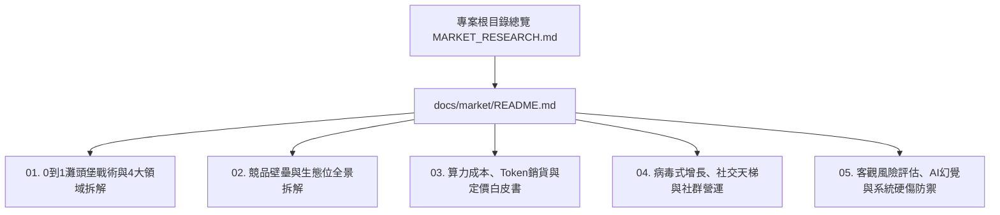

# 📑 Learn8 全新 AI 產品 0 到 1 市場戰略與專題白皮書矩陣
**Learn8: AI-Native Adaptive Micro-learning & Gamification Engine**  
*白皮書總入口文檔 | 位置：專案根目錄 `MARKET_RESEARCH.md` | 版本：v2.0 (模組化擴增版)*

---

> [!NOTE]
> **調研宗旨與模組化白皮書架構說明**  
> 本專案市場白皮書完全拋棄無用的巨幅空話，採 **極致詳細、中立客觀與實事求是** 的標準，針對 Learn8 作為一款 **全新的 0 到 1 AI 產品** 進行全方位剖析。  
> 為了克服單一檔案的篇幅限制，完整白皮書已拆解為 **5 大專題白皮書**，收錄於 [`docs/market/`](./docs/market/README.md) 目錄中。

---

## 📚 專題白皮書矩陣導讀 (Whitepaper Sitemap)

點擊下方連結可直接閱讀各領域的超詳細白皮書：

### 1. 📘 [白皮書 01：0 到 1 灘頭堡戰術與 4 大領域深度拆解](./docs/market/01_0_TO_1_BEACHHEAD_PLAYBOOK.md)
- **核心內容**：針對 **軟體工程/技術學習者**、**專業證照/高壓備考族**、**知識型 KOL/創作者** 與 **中小企業 SOP 內訓** 4 大垂直領域，制定冷啟動溝通文案、獲客渠道、誘餌設計與 0 到 10,000 用戶漏斗轉化指標。

### 2. 📘 [白皮書 02：競品壁壘與生態位全景拆解](./docs/market/02_COMPETITOR_MATRIX_AND_MOATS.md)
- **核心內容**：對比 Google NotebookLM, Duolingo, Brilliant.org, Khanmigo, Coursebox, Quizlet 6 大旗艦競品的 Feature-by-Feature 深度剖析，並提煉出 Learn8 的 **「三層防守護城河 (Defensive Moats)」**。

### 3. 📘 [白皮書 03：算力成本、Token 銷貨模型與定價白皮書](./docs/market/03_FINANCIAL_UNIT_ECONOMICS_AND_PRICING.md)
- **核心內容**：單次 Session 銷貨成本精算 ($0.074 美元/次)、Gemini Flash/Pro 雙軌模型分流、Semantic Cache 降本 65%、Freemium + Credit Ledger 點數帳本定價與 LTV/CAC (8.98x) 財務模型。

### 4. 📘 [白皮書 04：病毒式增長、社交天梯競技與社群營運](./docs/market/04_VIRAL_GROWTH_AND_COMMUNITY_FLYAWAY.md)
- **核心內容**：Elo 排位配對演算法 ($\Delta R = K(S-E)$)、即時 PvP 搶答與 6 大段位、Sandbox Course Fork 版稅分潤 (Royalty)、K-Factor 病毒係數模擬與 Discord/Reddit 社群營運劇本。

### 5. 📘 [白皮書 05：客觀風險評估、AI 幻覺與系統硬傷防禦](./docs/market/05_RISK_ASSESSMENT_AND_MITIGATION.md)
- **核心內容**：競技場冷啟動 **「影子 AI 對手 (Ghost Bots)」** 方案、**「漸進式關卡渲染」** (感知延遲由 45s 降至 <3s)、AI 考官評分 **「一鍵申訴與仲裁 Protocol」**、DMCA 避風港與 GDPR 金融級數據防護。

---

## 🔗 外部權威參考資料與產業連結
1. [a16z: How Consumer AI is Reshaping Education](https://a16z.com/everyday-ai-consumer-apps/) (Consumer PLG 趨勢)
2. [MarketsandMarkets AI in Education Report](https://www.marketsandmarkets.com/Market-Reports/artificial-intelligence-education-market-200371366.html) (市場規模數據)
3. [Grand View Research AI Education Analysis](https://www.grandviewresearch.com/industry-analysis/artificial-intelligence-ai-education-market) (亞太市場成長率)
4. [Duolingo Product & Growth Case Study](https://www.duolingo.com/) (遊戲化留存與排行榜)
5. [Google NotebookLM Overview](https://notebooklm.google.com/) (知識庫競品)
6. [OpenView 2024 SaaS Benchmarks](https://openviewpartners.com/) (LTV/CAC 數據)
