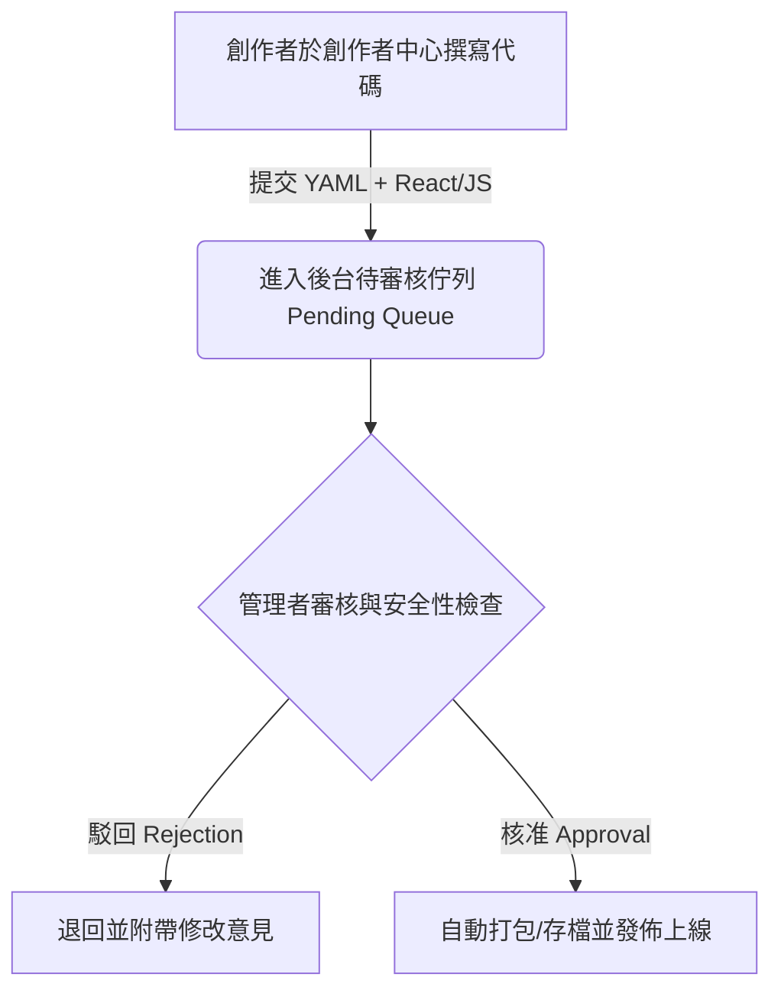

# ♟️ 創作者中心題型組件（Creator-built Components）優化提案：全功能程式碼與審核架構

為了支援創作者開發高度複雜且沉浸式的互動題型（例如：**西洋棋殘局解題、互動式程式碼編輯器、動態圖表題**），創作者必須擁有完整的程式碼編寫自由。

針對安全性與發佈速度的問題，我們將採用 **「獨立前端動態載入」** 與 **「管理者審核工作流 (Admin Review Workflow)」** 來進行優化。這既能讓創作者發揮無限創意，又能兼顧平台的資安與發佈流暢性。

---

## 🎨 1. 創作者提交通道與審核流程

為了確保全功能程式碼的安全性，創作者提交的所有題型組件皆需進入審核佇列。



### 管理者審核中心（Admin Review Center）
1. **代碼檢查**：管理者可以在後台直接檢視創作者上傳的 React 源碼與 YAML 規則。
2. **安全沙盒測試**：點擊「預覽題型」，系統會在一個獨立的 Sandbox 環境（如隔離的 Iframe）中，使用測試數據來載入該組件，防止惡意代碼損害管理台主頁面。
3. **一鍵發佈**：核准後，題型狀態轉為 `Active`，系統會觸發自動化的模組掛載與打包工作。

---

## 🏗️ 2. 全功能題型的動態載入與打包架構 (Hot-Reloading Architecture)

為了不讓每次創作者新增「西洋棋題型」時，前端都需要停機並重新進行 `Next.js build`，我們採用 **動態模組導入 (Dynamic Import / Async Module)**：

```
                    ┌──────────────────────────────┐
                    │      Learn8 Frontend Web     │
                    └──────────────┬───────────────┘
                                   │ (動態載入)
                                   ▼
                    ┌──────────────────────────────┐
                    │ uploads/creator_components/  │
                    │   └── chess_module.esm.js    │
                    └──────────────────────────────┘
```

### 1. 創作者提交題型封裝 (ESM Bundle)
* 創作者可以編寫一個獨立的 React 組件。
* 創作者中心提供網頁版線上編輯器（Web-based IDE）或上傳打包好的單一 `.js` 檔案（符合 ESM / UMD 規範）。
* 通過審核後，系統會把該檔案保存到伺服器的 `uploads/creator_components/chess_module.esm.js` 中。

### 2. 前端動態引入 (Dynamic Remote Component)
* 前端不需要在本地硬碟存有源碼。當遇到創作者自訂的題型（如 `ChessQuiz`）時，前端的萬用渲染器（`CreatorComponentLoader`）會透過動態 `import()` 或 `next/dynamic` 從伺服器靜態資源目錄讀取該 ESM `.js` 檔案：

```tsx
import React, { useEffect, useState } from "react";

export default function CreatorComponentLoader({ moduleName, stageProps }) {
  const [CustomComponent, setCustomComponent] = useState<any>(null);

  useEffect(() => {
    // 從伺服器靜態目錄中，動態載入經審核通過的獨立題型 js 檔
    import(/* webpackIgnore: true */ `/uploads/creator_components/${moduleName}.esm.js`)
      .then((mod) => setCustomComponent(() => mod.default))
      .catch((err) => console.error("無法動態載入創作者組件", err));
  }, [moduleName]);

  if (!CustomComponent) return <div>載入中...</div>;

  return <CustomComponent {...stageProps} />;
}
```

### 3. 後端動態 YAML 合併與載入
* 後端 `ComponentRegistryLoader` 經過核准後，會將創作者提交的 `Chess.yaml` 規則寫入一個動態載入目錄（例如 `game_modules/creator/`），並在伺服器不重啟的情況下直接熱重載載入至後端註冊表（Registry）。

---

## 🎯 3. 優化後的開發與發佈體驗

* **極致自由度**：創作者不論想實作什麼複雜的互動、動畫、圖形與資料結構（如西洋棋殘局、打字練習、物理實驗模擬），都可以在自己的 React 程式碼中完整開發。
* **安全性有保障**：藉由專業管理者的代碼審核（Human Review）與沙盒預覽，防範任何潛在的資安威脅。
* **秒級發佈上線**：管理者點擊「審核通過」後，檔案會直接熱發佈（Hot-deployed）到靜態目錄中。前端的萬用渲染器在下一次遇到此題型時，即可透過動態請求渲染出最新的、極具創意的題目介面！
   