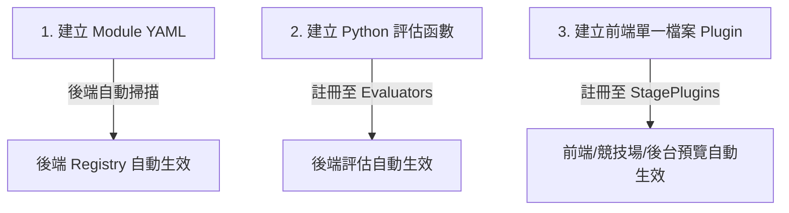

# ⚙️ 題型開發流程優化提案：消除冗餘與自動化整合

本提案針對 Learn8 當前新增一個題型組件時，所需修改的 9 個檔案與步驟進行深度檢視，找出其中的「冗餘」與「重複性工作」，並提出**「合併、自動化與動態註冊」**的優化方案，將原先的 9 個步驟大幅縮減至最精簡的狀態。

---

## 🔍 現有流程的 4 大冗餘與痛點

### 冗餘 1：後端模組白名單限制 (`ENABLED_GAME_MODULES`)
* **現況**：即使創作者/開發者在 `backend/game_modules/` 新增了 YAML，還必須手動修改 `app/core/config.py` 將其加入啟用清單，否則無法載入。
* **優化方案**：**「資料夾自動掃描 (Auto-discovery)」**。後端載入器直接讀取 `game_modules/` 資料夾下的所有 `.yaml` 檔案，無須維護手動白名單字串。

### 冗餘 2：前端重複包裝 Plugin 元件
* **現況**：新增題型時，必須同時建立一個主要 React 元件（如 `ShortAnswerQuestion.tsx`），再建立一個插件封裝檔 `plugin.tsx`。
* **優化方案**：**「檔案合併 (Single-file Component & Plugin)」**。將主要 React 元件、資料解析函數（`parseStage`）與插件創建語法（`createLessonStagePlugin`）合併寫在同一個單一檔案中，減少不必要的資料夾層級。

### 冗餘 3：前端多處手動 `switch-case` 渲染對應
* **現況**：競技場模組（`ArenaQuestionPreview.tsx`、`ArenaMatchPageClient.tsx`）擁有自己獨立的渲染與 `switch-case` 分支，每次新增題型都要手動補齊。
* **優化方案**：**「擴展 Plugin 元數據 (Plugin Metadata Driven)」**。在建立題型插件時，允許直接將「競技場對戰渲染器 (matchRenderer)」、「競技場預覽渲染器 (previewRenderer)」、「圖標 (icon)」當作選填參數傳入。

### 冗餘 4：前端 `apiTypes.ts` 中手動枚舉型別字串
* **現況**：必須在 `LessonStageComponent` 中手動加入新的題型字串。
* **優化方案**：改用 **動態字串型別** `export type LessonStageComponent = string;` 或者將所有型別由後端生成或插件表推導（`typeof lessonStagePluginRegistry[key]`），避免手動更新全域型別。

---

## 🚀 優化後的精簡流程：9 步縮減至 3 步！

透過以上的合併與自動化優化，未來新增一個新題型組件（例如：`ShortAnswer`），**只需建立 3 個檔案**，其餘全自動整合：



### 步驟 1：建立 Module YAML 
在 `backend/game_modules/ShortAnswer.yaml` 建立題型規格，後端啟動時**自動掃描載入**。

### 步驟 2：建立 Python 評估函數
在 `backend/app/services/lesson_components/evaluators.py` 中撰寫該題型的作答判定，並綁定註冊。

### 步驟 3：建立前端單一檔案題型 Plugin
將元件視覺、對戰邏輯、預覽、與 Icon 通通在同一個前端檔案內處理並導出，匯入至 `stagePlugins` 即完成全站註冊：

```tsx
"use client";
import React from "react";
import { FiEdit3 } from "react-icons/fi";
import { createLessonStagePlugin } from "../../renderers/types";

// 1. 核心題型 UI
export function ShortAnswerQuestion({ question, onComplete }) {
  return <div>{/* 創新的互動介面，如西洋棋或簡答題 */}</div>;
}

// 2. 插件與競技場整合定義
export const shortAnswerPlugin = createLessonStagePlugin(
  "ShortAnswer",
  ({ stage, actions }) => (
    <ShortAnswerQuestion
      question={stage.topic}
      onComplete={(input) => actions.submitStage(stage, { userInput: input })}
    />
  ),
  {
    displayName: "Short Answer",
    icon: <FiEdit3 />,
    capabilities: { supportsHint: true, supportsSkip: true, usesFeedbackOverlay: false },
    // 競技場自動化動態預覽
    previewRenderer: ({ prompt }) => <ShortAnswerQuestion question={prompt} onComplete={() => {}} />,
    // 競技場對戰自動化渲染
    matchRenderer: ({ question, onSubmit }) => <ShortAnswerQuestion question={question.topic} onComplete={onSubmit} />
  }
);
```

### 💡 優化總結
透過這個重構提案，競技場不再有獨立且僵化的 `switch-case`，後端也不再需要繁瑣的開關。新增題型變得高度整合且一氣呵成，最符合創作者中心或快速迭代的架構需求！
