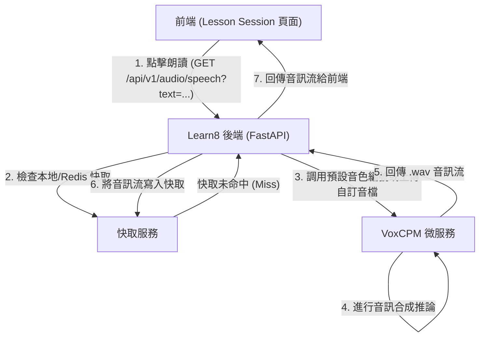

# 🎧 VoxCPM 語音服務導入 Learn8：單元課程題目朗讀方案

本文檔針對將 **VoxCPM 語音微服務** 導入至 **Learn8 單元課程（Lesson Session）題目與說明朗讀** 的整合方案。

此方案專注於單一核心目標：**在學習單元節點中為題目內容加入語音導讀功能**，讓學習者能透過聽覺輔助理解題目內容。

---

## 🎯 1. 核心整合目標

* **應用場景**：學習者在進行課程（`Lesson Session`）單元時，各題型上方（如：選擇題、費曼教學法、排序題等）提供語音朗讀按鈕。
* **功能需求**：點擊按鈕，後端即向 **VoxCPM** 發送語音合成請求並即時返回音訊流；搭配快取機制減少重複生成相同文字的推論負載。
* **進階特點**：
  - **聲音一致性**：透過固定參考音檔（Voice Cloning）確保每個助教的音色高度一致。
  - **個人化設定**：全域可切換助教類型、可切換「自動播放」或「手動點擊播放」。
  - **檔案傳輸橋樑**：預設參考音檔直接存於 VoxCPM 端，自訂聲音則透過 Learn8 傳輸給 VoxCPM。
  - **管理控制中心**：將原本的 `/admin/arena` 升級擴展為全功能的 **Learn8 UI 控制中心**。

---

## 🏗️ 2. 系統架構與資料傳輸橋樑

為保護微服務並提供語音快取功能，架構如下：



### 📂 檔案與音色編號儲存策略

1. **預設助理語音（Preset Voices）**：
   - 音檔檔案（`.wav`）直接存放於 **VoxCPM 微服務本地目錄**（例如 `presets/`）。
   - Learn8 端呼叫 VoxCPM 時，只需要在 API 傳入對應的音色編號或檔名（如 `preset_01`）。免去每次推論時跨主機網路傳輸大型參考音檔。
2. **自訂語音助理（User-defined Custom Assistants）**：
   - 當學習者自訂並上傳參考音檔（如自己錄製的聲音）時，Learn8 後端將暫存該音檔。
   - 隨後透過 `httpx.AsyncClient().post(VOXCPM_UPLOAD_URL, files={"file": ...})` 發送給 VoxCPM，微服務接收並賦予其唯一的 `custom_id` 供後續生成使用。

---

## ⚙️ 3. 個人化語音助理與播放配置方案

我們在 `ProfileSettingsDialog.tsx` 的「Preferences」區塊中，提供使用者兩種語音助理設定：

### 3.1 專屬 AI 語音助理選單 (Presets)
預先準備 5 個助教音色編號，在進行語音合成時將該編號傳入 `reference_wav_path` 或專用參數，達成極致的聲音一致性。

| 助理名稱 | 音色編號 | 微服務對應預設音檔 |
| :--- | :---: | :--- |
| **1. 溫柔學姐** | `preset_01` | `presets/gentle_sister.wav` |
| **2. 博學導師** | `preset_02` | `presets/wise_tutor.wav` |
| **3. 元氣夥伴** | `preset_03` | `presets/energetic_partner.wav` |
| **4. 冷靜AI助理** | `preset_04` | `presets/calm_ai.wav` |
| **5. 暖心大叔** | `preset_05` | `presets/warm_uncle.wav` |

### 3.2 播放模式切換：自動播放 (Auto Play) vs 手動播放 (Manual)
提供一個布林開關，讓學習者根據習慣自行調整：
* **自動播放**：一旦進入新的單元或題目，前端自動對後端發送請求並朗讀題目文字。
* **手動播放**：進入題目時保持安靜，需手動點擊「唸題目」按鈕才發聲。

---

## 🛠️ 4. 管理者介面升級：UI 控制中心（Admin Control Center）

原本 `/admin/arena` 將擴充為 **Learn8 管理控制中心**，並在畫面上新增「語音助理管理」面板：

```
+-------------------------------------------------------------+
|                     Learn8 管理控制中心                       |
+-------------------------------------------------------------+
|  [Arena 管理]  [公開課程管理]  [ RAG 管理 ]  *[語音助教管理]*  |
+-------------------------------------------------------------+
|                                                             |
|  * 語音助理配置與列表：                                       |
|    - 溫柔學姐 (preset_01) [編輯] [刪除]                       |
|    - 博學導師 (preset_02) [編輯] [刪除]                       |
|    - 新增語音助理按鈕：[+ 新增語音助理]                      |
|                                                             |
|  * 新增/修改語音助理設定：                                   |
|    - 名稱：______________________                           |
|    - 預設編號/ID：preset_06                                  |
|    - 聲音風格描述：______________________                    |
|    - 上傳音色參考音檔 (.wav)： [ 選擇檔案 ]                   |
|                                                             |
|  [儲存設定]                                                 |
+-------------------------------------------------------------+
```

### 📋 管理中心功能說明

1. **助理列表管理**：管理者可在此檢視目前所有開放給使用者挑選的語音助理名單、編號與描述。
2. **新增與自訂助理**：管理者上傳新的參考音檔後，後端透過轉發橋樑直接同步儲存於 VoxCPM 端，擴充使用者的可選名單。
3. **一致性鎖定**：管理者可預先在此對所有預設語音進行音訊測試與風格校正。

---

## 🐍 5. 後端實作方案

在 Learn8 後端新增 `/api/v1/audio/speech` 端點，負責讀取指定助教編號並發送給 VoxCPM。

### 5.1 路由端點設計

在 `backend/app/api/v1/endpoints/audio.py`：

```python
import httpx
import hashlib
from fastapi import APIRouter, HTTPException, Query, UploadFile, File
from fastapi.responses import StreamingResponse

router = APIRouter()

VOXCPM_URL = "http://127.0.0.1:8000/v1/audio/speech"
VOXCPM_UPLOAD_URL = "http://127.0.0.1:8000/v1/audio/upload"

# 預設 5 個聲音設定映射於 VoxCPM
VOICE_PRESETS = {
    "preset_01": "presets/gentle_sister.wav",
    "preset_02": "presets/wise_tutor.wav",
    "preset_03": "presets/energetic_partner.wav",
    "preset_04": "presets/calm_ai.wav",
    "preset_05": "presets/warm_uncle.wav"
}

@router.get("/speech")
async def get_cloned_speech(
    text: str = Query(..., description="要朗讀的題目文字內容"),
    preset: str = Query("preset_01", description="選用的助教音色編號"),
):
    """
    透過向微服務傳遞固定音檔路徑或 ID，達到聲音絕對一致
    """
    if not text.strip():
        raise HTTPException(status_code=400, detail="文字內容不可為空")

    ref_path = VOICE_PRESETS.get(preset, VOICE_PRESETS["preset_01"])

    payload_str = f"{text}_{ref_path}"
    cache_key = hashlib.md5(payload_str.encode("utf-8")).hexdigest()

    # [Todo] 檢查快取
    
    payload = {
        "text": text,
        "reference_wav_path": ref_path,  # 由 VoxCPM 直接讀取其本地音檔
        "cfg_value": 2.0,
        "inference_timesteps": 15,
        "denoise": True
    }
    
    try:
        async with httpx.AsyncClient() as client:
            response = await client.post(VOXCPM_URL, json=payload, timeout=180.0)
            
        if response.status_code != 200:
            raise HTTPException(status_code=response.status_code, detail="語音合成服務錯誤")
            
        # [Todo] 快取音檔

        return StreamingResponse(
            iter([response.content]), 
            media_type="audio/wav"
        )
        
    except Exception as e:
        raise HTTPException(status_code=500, detail=f"語音微服務連線失敗: {str(e)}")

@router.post("/upload-preset")
async def upload_voice_preset_bridge(file: UploadFile = File(...)):
    """
    檔案傳輸橋樑：Learn8 管理控制中心將檔案轉發給 VoxCPM 進行聲音克隆註冊
    """
    try:
        async with httpx.AsyncClient() as client:
            files = {"file": (file.filename, await file.read(), file.content_type)}
            response = await client.post(VOXCPM_UPLOAD_URL, files=files, timeout=60.0)
            
        if response.status_code != 200:
            raise HTTPException(status_code=response.status_code, detail="VoxCPM 檔案上傳失敗")
            
        return response.json()
        
    except Exception as e:
        raise HTTPException(status_code=500, detail=f"微服務連線失敗: {str(e)}")
```

---

## 🎨 6. 前端 UI/UX 整合方案

### 6.1 `ProfileSettingsDialog.tsx` 全域偏好設定更新

在彈窗的 Preferences 中加入語音助理與自動播放開關：

```tsx
<div className="space-y-3">
  {/* 助理選單 */}
  <div className="flex items-center justify-between gap-4">
    <span className="shrink-0 text-sm text-brand-gray-600">AI 語音助教</span>
    <select
      value={preferences.voiceAssistant || "preset_01"}
      onChange={(e) => setPreferences({ voiceAssistant: e.target.value })}
      className="rounded-lg border border-brand-gray-200 bg-white px-2 py-1 text-xs text-brand-gray-700 shadow-sm outline-none transition focus:border-brand-teal focus:ring-1 focus:ring-brand-teal"
    >
      <option value="preset_01">溫柔學姐</option>
      <option value="preset_02">博學導師</option>
      <option value="preset_03">元氣夥伴</option>
      <option value="preset_04">冷靜AI助理</option>
      <option value="preset_05">暖心大叔</option>
    </select>
  </div>

  {/* 自動播放開關 */}
  <div className="flex items-center justify-between">
    <span className="text-sm text-brand-gray-600">自動播放題目語音</span>
    <ProfileToggle
      on={preferences.autoPlaySpeech || false}
      onChange={() => setPreferences({ autoPlaySpeech: !preferences.autoPlaySpeech })}
    />
  </div>
</div>
```

---

## 🚀 7. 快速上線行動指南

1. **升級管理控制中心**：擴展 `frontend/src/app/(dashboard)/admin` 為 UI 控制中心，並新增專屬的 `voice-assistants/page.tsx`。
2. **註冊後端檔案橋樑**：
   - 新增 `backend/app/api/v1/endpoints/audio.py`。
   - 掛載路由至 `api.py`，支持題目唸讀 API 及檔案轉發橋樑 API。

---

## 🧠 8. 進階優化：預先生成單元導讀音檔方案 (Pre-generation Strategy)

為進一步提升使用者體驗（WOW 特效），音檔生成應改為**非同步預先載入模式**：

### 8.1 設計理念與資料流
1. **觸發時間點**：
   - 當系統產生學習單元節點（Generate Lesson / Node Stage）時，後端主動為每個題目生成對應的導讀音檔。
2. **音檔生成與儲存**：
   - 後端調用背景任務（Background Tasks），向 VoxCPM 請求合成語音。
   - 將返回的語音字節流轉存為 `.wav` 檔至 Learn8 的檔案儲存系統（與單元節點目錄綁定）。
3. **前端快速播放**：
   - 當使用者點擊進入單元節點時，音檔早已就緒（Pre-rendered）。
   - 前端點擊「唸題目」或自動播放時，無需再等待深度學習推論的時間，秒速發音，達到無縫流暢的極致體驗。

### 8.2 後端快取架構
- 新增背景非同步任務：`generate_lesson_audio_task(lesson_id: int, text: str)`。
- 在 `LessonModel` 的 `stage` 資料結構中（如 `draft_json` 或 `syllabus_json`）附帶 `audio_url: str` 指向預產生的靜態音檔路徑。

### 8.3 針對歷史關卡的解決方案 (Historical Support)

對於過去已經生成完、沒有導讀音檔的歷史關卡，可採行以下兩種方案並行：

#### 方案 A：即時生成並快取 (Lazy Load & Cache Fallback) - **推薦預設**
- 當使用者點擊進入歷史關卡並嘗試播放音檔時，前端發送請求。
- 後端若發現該節點的導讀音檔尚未存在（`audio_url` 為空），則**即時向 VoxCPM 請求合成，同時將音檔轉存為靜態檔案並更新到節點資料中**。
- 如此一來，任何歷史關卡只要被造訪一次，未來便不需要重複生成，達成自動動態補建的效果。

#### 方案 B：歷史關卡補建任務 (Historical Batch Generation)
- 在 UI 控制中心（`/admin/arena`）提供一個「補建歷史關卡音檔」的按鈕。
- 當管理者點擊後，後端會掃描資料庫中所有 `audio_url` 為空的歷史節點題目，透過限流背景任務，依序批次補齊所有的導讀音檔。

---

## 🌐 9. 全域題型支援擴充方案 (Multi-Question Type Audio Support)

為了讓 Learn8 內建的所有課程單元與題型皆能享有極致的個人化導讀體驗，我們將語音合成支援拓展至其他四大題型：

### 9.1 前端 UI 整合地圖
1. **FeynmanQuestion (費曼提問)**
   - **讀取欄位**：`data.prompt` 或情境描述內容。
   - **呈現方式**：在費曼對話或問題描述右側放置 `<QuestionVoiceReader />`。
2. **MatchingPairsQuestion (連連看/配對題)**
   - **讀取欄位**：`data.prompt`。
   - **呈現方式**：在連連看的指令區塊上方或右側顯示語音導讀按鈕。
3. **OrderingQuestion (排序題)**
   - **讀取欄位**：`data.prompt`。
   - **呈現方式**：在排序任務的指示文字旁邊放置語音導讀按鈕。
4. **ExplainerMediaCard (概念解析卡片)**
   - **讀取欄位**：主要摘要文字內容。
   - **呈現方式**：點擊「播放導讀」即可唸讀目前關卡的核心解析文字。

### 9.2 後端快取無縫相容
- 後端的音檔代理與預渲染模組原本即為**題型無關 (Question-Type Agnostic)**。
- 當新的單元生成時，不論是何種題型（Matching, Ordering, Feynman），只要其設定中具備文字字串，非同步背景任務皆會主動對該題目進行預渲染與快取建置。

### 9.3 🚀 進階優化：YAML 宣告式導讀欄位 (Dynamic Schema Voice Targets)

為了讓創作者中心在未來新增自訂題型（例如：西洋棋題型）時，能無縫整合語音服務，我們引入**「YAML 宣告式導讀欄位」**：

1. **模組 YAML 擴充**：
   在 `game_modules/*.yaml` 中，新增 `voice_targets` 欄位指定哪些屬性需要語音轉換：
   ```yaml
   name: MultipleChoice
   voice_targets:
     - question
   ```
2. **自動提取朗讀字串**：
   後端預渲染與音檔服務在對題型產生導讀音檔時，會動態掃描 `voice_targets` 中的欄位，並將 `config.data` 內對應的文字提取並合成。
3. **創作者親和度**：
   這讓創作者完全不用寫任何後端代碼，就能一鍵啟用高度專業的語音導讀服務！


