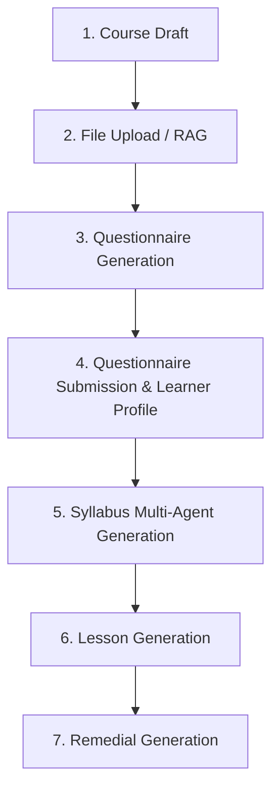

# 🎨 個人化課程生成流與核心流程功能 (Complete Architectural Guide)

Learn8 是一個先進的 **AI 驅動式學習平台**。本文檔完整梳理了平台最核心的生成管線，並重點闡述了如何透過技術手段實現**極致的個人化教學體驗**。

---

## 🌟 0. 產品價值與 UX 亮點 (Product Value)

生成管線的設計理念在於將「複雜的 AI 運算」轉化為「簡單、直覺且充滿溫度」的用戶旅程：

- **極致個人化 (Hyper-Personalization)**：透過「診斷問卷」與「學員畫像」技術，AI 不再是冷冰冰的複讀機，而是能讀懂學員痛點、根據學員程度調整難度的**虛擬私教**。
- **透明的生成美學 (Generation Aesthetics)**：利用 SSE 非同步技術，將後端數十個 Agent 的思考過程化作前端流暢的進度推播，讓學員在等待時也能感受到內容正在被精心「編織」的過程。
- **多樣化教學組件 (Pedagogical Variety)**：系統會自動根據知識點的屬性（是需要理解的原理，還是需要背誦的單字）來選擇最適合的關卡（如費曼技巧或排序題），實現「因材施教」。

---

## 🏗️ 1. 整體核心學習生命週期 (End-To-End Pipeline)

Learn8 藉由非同步 SSE Jobs、RAG 特徵提取，與 **多代理人協作大綱生成**，為使用者精準生成客製化學習內容。整個生命週期共有 7 個階段：



---

## 🧬 2. 深入 7 大生成階段之 I/O 規格

### 階段 1: Course Draft
- **用途**：學員提供感興趣的主題或探索方向，並創立課程進度。
- **輸入**：
  - `topic`: 主題關鍵字（字串）。
  - `prompt_preference`: 教學偏好描述。
- **輸出**：建立一個全新的 `CourseModel` 實體。

### 階段 2: File Upload / RAG Context
- **用途**：用戶上傳教材檔案，系統將其統一解析為 Markdown 並提取圖片資源，隨後提取 Embedding 向量特徵寫入向量資料庫。
- **支援格式**：PDF (`.pdf`), Word (`.docx`), PowerPoint (`.pptx`), Excel (`.xlsx`), Markdown (`.md`), Plain Text (`.txt`)。
- **解析引擎與策略**：
  - **Office 文件**：透過 **Microsoft MarkItDown** 將 Office 文件轉檔為 Markdown，並自動抽取其中嵌有的圖片，進行 Base64 解碼後存檔。
  - **PDF 文件**：根據 `PDF_PARSE_STRATEGY` 環境變數，支援 4 種轉檔策略：
    - `basic`：0成本純文字提取 (使用 PyMuPDF)。
    - `vision`：強制對所有頁面進行多模態視覺 LLM 渲染與解析。
    - `hybrid`：智慧混搭 (無圖頁面用 basic，有圖頁面用 vision)。
    - `ocr`：使用 **MarkItDown + Gemini OCR 視覺模型**。提取 PDF 實體圖片並僅對圖片做 VLM 文字描述提取，兼具低成本與高精準度。
- **輸出與存儲**：
  - 解析出的 Markdown 保存為文字，並切分 chunks 寫入向量資料庫 **`backend/data/chroma_db/`**。
  - 提取出的實體圖片保存於 `backend/data/uploads/{user_id}/{course_folder}/images/` 下。
  - 提取出的圖片屬性與 VLM 描述被寫入資料庫 **`course_media_assets`** 表，為後續講義生成提供 RAG 圖片目錄。

### 階段 3: Questionnaire Generation
- **用途**：依 `topic` 與上傳的 RAG context 生成 3 個探索型診斷問卷問題。
- **輸入**：
  - `topic`: 主題關鍵字；`course_id`: 課程識別 ID。
- **輸出**：
  - `questions`: 3 道用來診斷程度與教學痛點的問答，寫入 Job `result_data.questions`。

### 階段 4: Questionnaire Submission / Learner Profile
- **用途**：學員回答 3 道問題，AI 將作答內容分析並摘要成 Learner Profile。
- **輸入**：
  - `questions`: 診斷問答題目；`submission`: 學員回答。
- **輸出**：
  - **`Learner Profile Summary`**：學員能力背景與學習風格摘要字串，並寫回 `courses.profile_json`。

---

### 階段 5: Syllabus Generation (💥 特色：多代理人架構 💥)
- **用途**：利用 **Planner Agent** 與 **Auditor Agent** 兩個代理人的協作與反思循環（Reflections Loop）生成高精準度的知識大綱。
- **架構特點**：
  ```mermaid
  sequenceDiagram
      autonumber
      participant App as SyllabusAgent Engine
      participant PA as 1. Planner Agent
      participant AU as 2. Auditor Agent

      App->>PA: 傳入主題、畫像與全文本 Context
      PA->>App: 生成初始草稿 (CoursePath Draft)
      loop 最大迭代 N 次 (MAX_SYLLABUS_AUDIT_REFLECTIONS)
          App->>AU: 提供當前大綱與自我反省記錄
          AU->>App: 產生 AuditorOutput (Critique + 修正 Actions)
          Note over App: 套用增刪修工具：UPDATE_UNITS / INSERT_NODES
      end
      App->>App: 完成最終驗證，將首個 Node 解鎖為 AVAILABLE
  ```

#### A. 規劃者代理人 (Planner Agent)
- **職責**：接收課程主題、學員畫像、以及全文本知識庫內容，構思最初始的教學地圖草稿。
- **輸入**：
  - `PLANNER_SYSTEM_PROMPT`。
  - 用戶輸入 `topic`, `profile_summary`, 以及完整檔案文本 `context`。
- **輸出**：`CoursePath` 原始草稿。

#### B. 審查者代理人 (Auditor Agent)
- **職責**：負責審查大綱草稿的邏輯流暢度與深度，產出修正建議並透過預定義變更工具批次對 `CoursePath` 進行增、修、刪、改。
- **輸入**：
  - `AUDITOR_SYSTEM_PROMPT`。
  - 當前 `CoursePath` 草稿，以及歷史反思記錄 (`critique_history`)。
- **輸出**：
  - `reflection_critique`: 對該大綱的批判與審查回饋。
  - `actions`: 欲對大綱草稿執行的批次修改工具指令清單（包含 `UPDATE_COURSE_METADATA`, `INSERT_UNITS`, `UPDATE_UNITS`, `INSERT_NODES`, `UPDATE_NODES`, `DELETE_NODES`）。
  - `is_complete`: 是否對目前大綱完全滿意（布林值）。當為 `true` 或達最大迭代次數時終止迴圈。
- **大綱落盤**：最終生成之精煉 CoursePath 寫入 `courses.syllabus_json` 並扁平化建立各單元的 `nodes` 實體。

---

### 階段 6: Lesson Generation
- **用途**：為單一學習節點（Node）生成包含多樣化、可自訂組件關卡的題目內容。
- **輸入**：當前節點主題、`LessonNode` 結構、學員畫像、`media_catalog` 圖片清單。
- **💥 多模態圖像生成技術 (Multimodal Slide Generation)**：
  - 如果該課程包含已註冊的圖片資源，`AIArchitectService` 會自動從本機目錄加載對應的實體圖片。
  - 將其轉換為 Base64 格式，並以多模態 `HumanMessage` 形式併入對話提示詞（Prompt）發送給 Gemini 視覺大模型。
  - 大腦 AI（LLM）能直接「觀看」實體圖像像素，並根據投影片內容在 `ExplainerMedia` 組件中精確選擇最相符的 `mediaIndex`。
- **輸出**：包含動態選擇的組件（如 `ExplainerMedia`, `FeynmanMirror`, `MultipleChoice` 等）的 `LessonStage[]`。AI 會根據知識點難度自動決定組件數量與順序。

### 階段 7: Remedial Generation
- **用途**：將同一學習階段中答錯的題型組件打包，自動為學員生成針對性的補救複習題目。
- **輸入**：`failedStages[]` 錯題。
- **輸出**：針對性補修或引導答題的 `LessonStage[]`。

---

## 💾 3. 讀全文 vs 只用 RAG（知識庫提取策略）

Learn8 針對不同階段的 AI 任務，採用了不同的知識獲取策略以優化生成品質與速度：

### A. 讀取全文（從 uploads 讀取完整文字塞入 Prompt）
此策略在生成廣度大、需要全盤架構理解的任務時採用：
- **Syllabus Generation** (大綱生成)：為確保單元不遺漏，會完整載入上傳檔案的全文本，作為大綱生成的 context 參考。

### B. 只用 Chroma / RAG（基於語義檢索提取片段）
此策略在生成精度高、需要快速獲取單一知識點的任務時採用：
- **Questionnaire Generation** (問卷生成)
- **Lesson Generation** (關卡題目生成)
- **Lesson Chat Tutor** (課堂助教問答)
- **Feynman Grading** (費曼評量評估)

---

## 📋 4. 進度與獎勵結算機制 (XP & Progress)

當用戶完成全部的主關卡或複習階段後，後端透過 API `POST /api/v1/lessons/sessions/complete` 觸發結算：
- **解鎖下一關卡**：讀取 `syllabus_json`，將當前節點狀態設為 `COMPLETED`，並將下一個節點設為 `AVAILABLE`。
- **發放 XP 經驗值與金幣**：經驗值增量 Delta 寫入 `user_ledger_events` 記錄，用戶的 `users.xp` 與 `users.level` 同步更新並落盤持久化。
