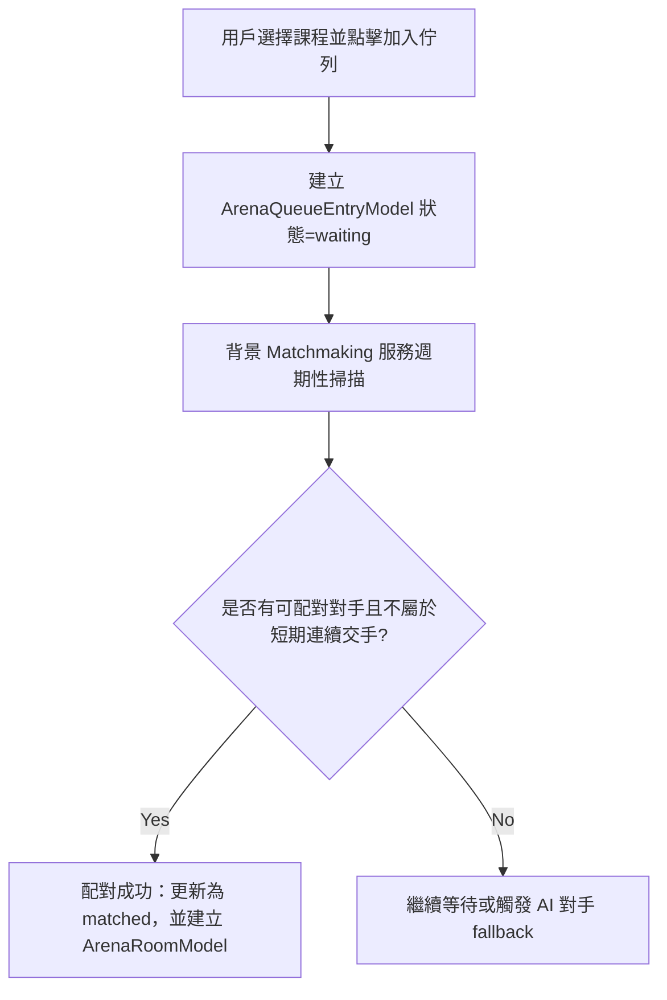

# ⚔️ 競技場功能與對決流程 (Maximum Detail Edition)

本文檔詳細記錄了 Learn8 競技場（Arena）的系統架構、匹配隊列、實時連線答題以及評分結算的完整代碼與業務流程。

---

## 💥 1. 競技場之架構亮點與特色 (Core Highlights)

Learn8 競技場具有以下極富競爭力的技術特色與設計：
- **動態防連續撞車算法**：系統利用 Elo 與歷史交手比分資料庫，在學員進入隊列時過濾掉短期內的相同對手，極大維持了匹配池的多樣性。
- **基於 Elo 公式的天梯排行評分**：採用國際標準的 Elo 積分公式進行比賽評估與實力變更，每場 PK 都對玩家實力進行準確評估，大幅增強了競技的公平性與趣味性。
- **實時 WebSocket 雙向答題同步**：比賽過程採用全雙工即時通訊，一方答題正確或錯誤，會即時扣減對手血量與分數，提供強烈的沈浸感與對戰氛圍。

---

## 🚦 2. 競技場底層架構

競技場是一個多人實時連線答題系統，允許用戶根據特定的課程進行知識 PK。其背後由多個數據表和服務共同支撐：

### 2.1 題庫架構 (`ArenaQuestionPoolModel`)
- 每個啟用競技場的課程，都在後端註冊一個題庫。
- 題庫包含多道由 AI 預先生成或官方設計的題目。

### 2.2 核心資料表關聯
- **`ArenaRoomModel`**：比賽房間。
- **`ArenaQueueEntryModel`**：佇列狀態。
- **`ArenaRatingModel`**：Elo 實力評級。
- **`ArenaMatchModel`**：完賽歷史記錄。

---

## 🔄 3. 匹配隊列流程 (Matchmaking Details)

### 3.1 佇列進入與匹配演算法
1. 學員加入：`POST /api/v1/arena/queue/join`。
2. 背景掃描：匹配服務檢索隊列中所有 `waiting` 狀態的選手。
3. 配對完成：建立比賽房間 `ArenaRoomModel`。

---

## 🥊 4. 實時對局連線與答題 (`Social/Chat WS`)

1. **連線建立與監聽**：雙方客戶端通過 WebSocket (`/api/v1/social/chat/ws`) 與後端保持實時同步。
2. **血量扣減機制**：學員回答錯誤，會在前台實時觸發傷害動畫與血條扣減。
3. **完賽與積分變動 (Elo Update)**：系統依據 Elo Rating 積分公式計算出雙方最新的積分，分數變動會立即寫入 `ArenaRatingModel`。

---

## 🛠️ 5. 競技場管理控制台 (Arena Admin Interface)

- **前端預設路徑**：**`/admin`**
- **後端路由前綴**：**`/api/v1/arena/admin`**
- **管理與維運功能亮點**：
  1. **Arena Builder** (`/public-courses` & `/question-pools`)：
     - 提供官方主題大綱管理與題庫池 CRUD。
     - 支援一鍵提取教學大綱題目（`extract_questions_from_syllabus`）以動態更新題庫池。
  2. **Seasons & Ranking** (`/seasons`)：
     - 管理當前活動賽季與歷史賽季、段位天梯時限、段位門檻等。
  3. **Operations & Telemetry** (`/health`, `/player-matches` & `/match-reviews`)：
     - **維運監控健康指標**：建立全站競技對戰健康快照（`ArenaAdminHealthSnapshot`）。
     - **對戰歷史查詢**：提供對戰搜索與選手參賽紀錄。
     - **異常對戰審核**：針對完賽率低、對局惡意退出、答題延遲異常等行為進行篩選與封鎖審查。
  4. **Course Reviews** (`/custom-courses/admin/pending`)：
     - 審查全站學員自訂並申請上架的課程，通過後自動開通競技場。
