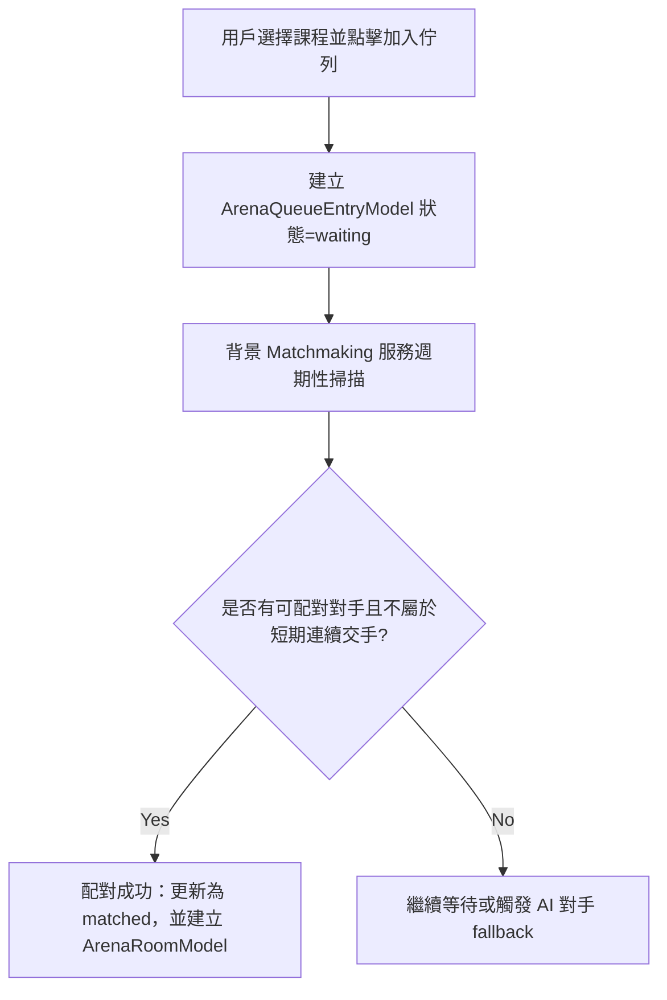

# ⚔️ 競技場功能與對決流程 (Maximum Detail Edition)

本文檔詳細記錄了 Learn8 競技場（Arena）的系統架構、匹配機制與產品體驗設計。競技場不僅是技術上的實時通訊系統，更是產品中**激發學習動力的核心引擎**。

---

## 🌟 0. 產品價值與 UX 亮點 (Product Value)

競技場的設計旨在將枯燥的複習轉化為刺激的社交遊戲體驗：

- **遊戲化動力學 (Gamification Dynamics)**：透過 Elo 積分與段位天梯，賦予學員強烈的成就感與目標感。每一場勝利都不只是分數的增長，更是知識掌握度的實力證明。
- **沉浸式即時對決 (Immersive Battle)**：WebSocket 驅動的實時血條扣減與打擊感，營造出高度緊張的「心流」狀態，迫使學員在壓力下快速檢索記憶，極大提升知識提取速度。
- **社交化學習 (Social Learning)**：不再是孤獨的答題，而是與真實好友、全站高手進行智力碰撞，透過「好友對戰邀請」建立學習社群的強連結。

---

## 💥 1. 競技場之架構亮點與特色 (Core Highlights)

Learn8 競技場具有以下極富競爭力的技術特色與設計：
- **動態防連續撞車算法 (Anti-Clash Logic)**：系統利用 Elo 與歷史交手比分資料庫，在學員進入隊列時透過 `exclude_previous_opponents` 邏輯過濾掉短期內的相同對手（預設為最近 3 場內），極大維持了匹配池的多樣性。
- **精準 Elo 天梯系統**：採用專業競技標準的 Elo 評分公式，並根據玩家的「穩定度 (K-factor)」動態調整積分增益。
- **雙向 WebSocket 狀態機**：後端維護一個嚴謹的對戰狀態機（`Initializing -> Countdown -> Battle -> Settling`），確保雙方客戶端同步看到相同的血條扣減與計時。

---

## 🚦 2. 競技場底層架構

競技場是一個多人實時連線答題系統，允許用戶根據特定的課程進行知識 PK。其背後由多個數據表和服務共同支撐：

### 2.1 題庫架構 (`ArenaQuestionPoolModel`)
- 每個啟用競技場的課程，都在後端註冊一個題庫。
- 題庫包含多道由 AI 預先生成或官方設計的題目。

### 2.2 核心資料表關聯
- **`ArenaRoomModel`**：比賽房間。
- **`ArenaQueueEntryModel`**：佇列狀態。
- **`ArenaRatingModel`**：Elo 實力評級。
- **`ArenaMatchModel`**：完賽歷史記錄。

---

## 🔄 3. 匹配隊列流程 (Matchmaking Details)



### 3.1 佇列進入與匹配演算法
1.  **進入隊列**：`POST /api/v1/arena/queue/join`。
2.  **配對邏輯 (`find_best_match`)**：
    - **Elo 區間檢查**：優先匹配評分差值在 $\pm 100$ 內的對手（`ARENA_MATCHMAKING_BASE_WINDOW`）。
    - **防撞車過濾**：排除 `ArenaMatchModel` 中最近產生的對手（預設最近 3 場）。
    - **動態放寬**：每過 5 秒（`WINDOW_STEP_SECONDS`），自動將 Elo 區間放寬 $\pm 50$（`WINDOW_EXPANSION`），最大上限為 $\pm 1000$。
    - **等待超時**：若在佇列過期時間內（預設 3 分鐘）未匹配成功，該請求將被標記為 `expired`。
    - **（進階特性：AI Fallback）**：*目前版本主要針對真人對戰優化，AI 對手機器人功能預計在未來版本中整合入背景調度中。*

---

## 🥊 4. 實時對局連線與訊息協議 (WebSocket Protocol)

對戰過程中，雙方客戶端與 `/api/v1/arena/ws` 連線（需帶 `access_token`），透過以下 `action` 格式通訊：

### 4.1 頻道訂閱 (`action: "subscribe"`)
在進入對戰前，前端需訂閱對應的 Match 或 Room 頻道：
```json
{
  "action": "subscribe",
  "matchId": 123,
  "roomCode": "ABCD"
}
```

### 4.2 答題提交 (`action: "submit_answer"`)
- **發送**：
```json
{
  "action": "submit_answer",
  "matchId": 123,
  "roundId": 5,
  "selectedOptionId": "b",
  "reqId": "nonce_123"
}
```

### 4.3 答題結果回饋 (`action: "answer_result"`)
當任一玩家提交後，後端會計算結果並廣播：
```json
{
  "action": "answer_result",
  "payload": {
    "isCorrect": true,
    "damageDealt": 15,
    "newOpponentHp": 85,
    "comboBonus": 2
  }
}
```
*(註：若為心跳檢測，客戶端發送 `action: "heartbeat"`，後端回傳 `type: "pong"`)*

---

## 📈 5. Elo 評分計算公式 (The Mathematics)

Learn8 採用以下數學公式來更新對戰後的 Rating：

### 5.1 預期勝率 (Expected Score)
對於玩家 A 與玩家 B，A 的預期勝率 $E_A$ 計算如下：
$$E_A = \frac{1}{1 + 10^{(R_B - R_A)/400}}$$
*(其中 $R_A, R_B$ 為當前積分)*

### 5.2 積分更新 (Rating Update)
對戰結束後，新的積分 $R'_A$ 為：
$$R'_A = R_A + K \times (S_A - E_A)$$
- **$K$ (K-Factor)**：預設為 32。
- **$S_A$ (Actual Score)**：勝利為 1，失敗為 0，平手為 0.5。

---

## 🛠️ 5. 競技場管理控制台 (Arena Admin Interface)

- **前端預設路徑**：**`/admin`**
- **後端路由前綴**：**`/api/v1/arena/admin`**
- **管理與維運功能亮點**：
  1. **Arena Builder** (`/public-courses` & `/question-pools`)：
     - 提供官方主題大綱管理與題庫池 CRUD。
     - 支援一鍵提取教學大綱題目（`extract_questions_from_syllabus`）以動態更新題庫池。
  2. **Seasons & Ranking** (`/seasons`)：
     - 管理當前活動賽季與歷史賽季、段位天梯時限、段位門檻等。
  3. **Operations & Telemetry** (`/health`, `/player-matches` & `/match-reviews`)：
     - **維運監控健康指標**：建立全站競技對戰健康快照（`ArenaAdminHealthSnapshot`）。
     - **對戰歷史查詢**：提供對戰搜索與選手參賽紀錄。
     - **異常對戰審核**：針對完賽率低、對局惡意退出、答題延遲異常等行為進行篩選與封鎖審查。
  4. **Course Reviews** (`/custom-courses/admin/pending`)：
     - 審查全站學員自訂並申請上架的課程，通過後自動開通競技場。
