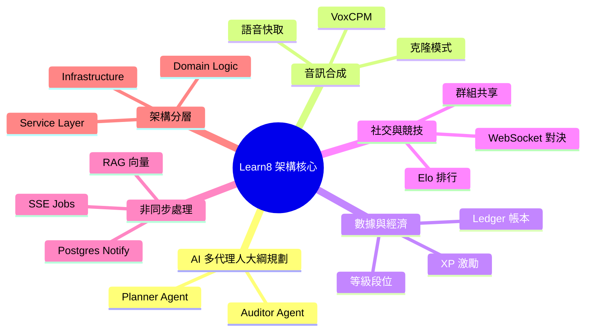

# 🏛️ 全站技術架構與亮點總覽 (Architecture Overview)

本文檔涵蓋了 Learn8 學習平台中其餘所有的高階技術架構與核心亮點，旨在展現一個**高可靠、低延遲且具備強大擴展性**的現代化後端系統。

---

## 🌟 0. 產品價值與 UX 亮點 (Product Value)

Learn8 的架構設計不僅是為了功能，更是為了提供極致的系統信任感與流暢感：

- **金融級的數據安全 (Bank-Grade Reliability)**：透過「帳本系統 (Ledger)」與「冪等性保護」，學員在平台上的每一分積累（XP、點數）都受到最嚴謹的保護，建立長期的產品忠誠度。
- **無縫的非同步交互 (Seamless Asynchronicity)**：SSE Job 佇列確保了即便在進行複雜的 AI 運算時，前端介面依然保持響應，這種「不等待、不卡頓」的體驗是留住高階用戶的關鍵。
- **高度解構的擴展性 (Scalability & DDD)**：領域驅動設計讓我們能以極快的速度新增社交或對戰功能，而不會影響核心學習引擎的穩定。

---

## 💥 1. 核心技術特色亮點 (Major Highlights)

### 1.1 異步 SSE Job 佇列與實時狀態更新 (`SSE Jobs via LISTEN/NOTIFY`)
為了解決大模型（LLM）與向量檢索處理時間長的問題，Learn8 不採用傳統的阻塞式 HTTP 請求，而是將耗時的 AI 任務全面轉為**背景 Job 佇列管理**。
- **SSE 事件流推播**：前端發起非同步任務請求後，系統會建立 `generation_jobs` 並立即回傳 `job_id`，隨後透過 PostgreSQL `LISTEN/NOTIFY` 機制，經由 `api/v1/jobs/{job_id}/stream` 端點，將生成任務的實時進度（如：問卷構思、大綱細化）主動推播至客戶端。
- **無縫中斷重連 (State Resuming)**：學員即便刷新頁面或網絡波動，前端亦可透過 `/api/v1/jobs/active` 自動獲取運行中的任務，確保生成體驗零中斷。

### 1.2 領域驅動設計與 Service 層封裝 (`Service Layer & DDD`)
為了提升程式碼的維護性與可測試性，Learn8 將所有核心業務邏輯從 API 端點中抽離，封裝進專門的 Service 類別中：
- **`CourseService`**：統籌課程的生命週期，包括 YAML 序列化、節點同步、以及跨領域的課程複製 (Forking) 邏輯。
- **`AudioService`**：封裝音訊合成流程、多級快取機制、以及與 VoxCPM 微服務的通訊協議。
- **`UserService`**：處理使用者頭像處理 (Pillow 轉換)、身分驗證與安全性的集中化邏輯。

### 1.3 完整的資料庫帳本經濟與經驗值系統 (`User Ledger Economy`)
為打造沈浸式且極具激勵性的學習旅程，全站整合了一套嚴謹的帳本系統：
- **基於 Ledger 的收支記錄**：不論是完成關卡獲得經驗值（XP），還是購買或消耗點數，系統均透過 `apply_user_ledger_event` 寫入一條不可竄改的 `user_ledger_events` 記錄，並以冪等性密鑰（Idempotency Key）確保交易安全不重複。
- **動態等級評定**：用戶的 XP 增長會自動觸發實時等級與段位評估，實現高度透明且激勵性的個人成長體系。

### 1.4 智慧課堂助教與社交互動 (`Chatroom & Tutor Assistant`)
- **課堂助教 (AI Tutor Assistant)**：答題過程中遇到困難時，學員可以隨時呼叫助教。助教結合了 RAG 知識庫，僅檢索相關單元背景知識片段（**不綁全文**），給出精準且簡潔的輔助提示。
- **好友與群組連線**：基於 WebSocket，學員可以一鍵與好友開展文字聊天，並分享、Fork 彼此心儀的學習課程。

### 1.5 全站安全與認證架構 (`Security & Auth`)
- **雙重密鑰驗證**：採用 JWT (JSON Web Token) 配合 `HS256` 算法，確保所有 API 端點的存取皆經過身份驗證。
- **不可竄改的密碼雜湊**：使用 `passlib` 與 `PBKDF2-SHA256` 進行密碼存儲，保證即便資料庫洩漏，用戶密碼也無法被還原。
- **交易冪等性保護**：在帳本經濟系統中，每一筆交易都綁定了一個 `idempotency_key`，徹底杜絕了因網路重連導致的重複扣款或重複加分風險。

---

## 📊 2. 全站技術亮點地圖

---

## 📚 3. 文檔索引與導讀 (Documentation Index)

為了幫助開發者快速定位，本專案提供了一套完整的技術白皮書：

1.  **[1_component_management.md](./1_component_management.md)**：題型組件、AI 生成約束與動態評估邏輯。
2.  **[2_api_service_guide.md](./2_api_service_guide.md)**：全站業務 API、SSE 監控、非同步 Job 流轉與錯誤處理。
3.  **[3_personalization_generation.md](./3_personalization_generation.md)**：7 大生成階段、多代理人 (Multi-Agent) 協作、RAG 檢索策略。
4.  **[4_arena_flows.md](./4_arena_flows.md)**：競技場匹配、Elo 公式、實時 WS 對戰。
5.  **[5_custom_courses_flows.md](./5_custom_courses_flows.md)**：課程 Fork 邏輯、沙盒進度模型、上架審核流。
6.  **[6_architecture_overview.md](./6_architecture_overview.md)**：**（本文件）** 技術架構總覽、Service 層 DDD 封裝、安全性設計。
7.  **[7_voxcpm_microservice.md](./7_voxcpm_microservice.md)**：語音微服務專屬手冊。
8.  **[8_admin_management_system.md](./8_admin_management_system.md)**：管理後台邏輯、題庫自動提取、系統引導機制。
9.  **[9_social_friendship_system.md](./9_social_friendship_system.md)**：好友關係、實時 WS 網關、對戰邀請。
10. **[10_database_schema_and_models.md](./10_database_schema_and_models.md)**：資料庫模型欄位定義與數據關聯圖。
11. **[11_background_workers_and_scheduling.md](./11_background_workers_and_scheduling.md)**：**（補齊中）** 任務調度機制與重試邏輯。

---
