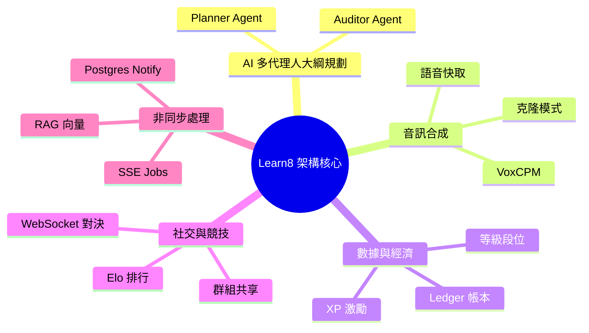

# 🏛️ 全站技術架構與亮點總覽 (Architecture Overview)

本文檔涵蓋了 Learn8 學習平台中其餘所有的高階技術架構與核心亮點，包括 SSE 背景 Job 佇列、實時聊天室社交、資料庫帳本激勵系統，以展現完整的全站技術版圖。

---

## 💥 1. 核心技術特色亮點 (Major Highlights)

### 1.1 異步 SSE Job 佇列與實時狀態更新 (`SSE Jobs via LISTEN/NOTIFY`)
為了解決大模型（LLM）與向量檢索處理時間長的問題，Learn8 不採用傳統的阻塞式 HTTP 請求，而是將耗時的 AI 任務全面轉為**背景 Job 佇列管理**。
- **SSE 事件流推播**：前端發起非同步任務請求後，系統會建立 `generation_jobs` 並立即回傳 `job_id`，隨後透過 PostgreSQL `LISTEN/NOTIFY` 機制，經由 `api/v1/jobs/{job_id}/stream` 端點，將生成任務的實時進度（如：問卷構思、大綱細化）主動推播至客戶端。
- **無縫中斷重連 (State Resuming)**：學員即便刷新頁面或網絡波動，前端亦可透過 `/api/v1/jobs/active` 自動獲取運行中的任務，確保生成體驗零中斷。

### 1.2 完整的資料庫帳本經濟與經驗值系統 (`User Ledger Economy`)
為打造沈浸式且極具激勵性的學習旅程，全站整合了一套嚴謹的帳本系統：
- **基於 Ledger 的收支記錄**：不論是完成關卡獲得經驗值（XP），還是購買或消耗點數，系統均透過 `apply_user_ledger_event` 寫入一條不可竄改的 `user_ledger_events` 記錄，並以冪等性密鑰（Idempotency Key）確保交易安全不重複。
- **動態等級評定**：用戶的 XP 增長會自動觸發實時等級與段位評估（`ActivityLogger.log_xp_award`），實現高度透明且激勵性的個人成長體系。

### 1.3 智慧課堂助教與社交互動 (`Chatroom & Tutor Assistant`)
- **課堂助教 (AI Tutor Assistant)**：答題過程中遇到困難時，學員可以隨時呼叫助教。助教結合了 RAG 知識庫，僅檢索相關單元背景知識片段（**不綁全文**），給出精準且簡潔的輔助提示。
- **好友與群組連線**：基於 WebSocket，學員可以一鍵與好友開展文字聊天，並分享、Fork 彼此心儀的學習課程。

---

## 📊 2. 全站技術亮點地圖

透過這份文件，Learn8 專案的所有高端特色已獲得完全覆蓋！
