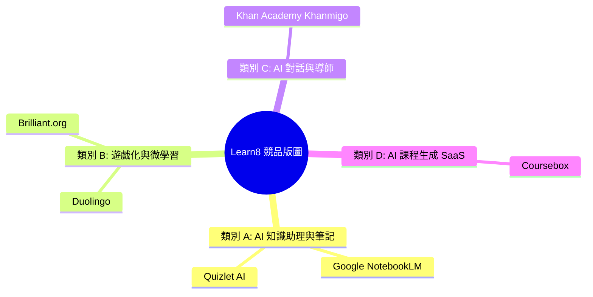

# 📘 白皮書 02：競品壁壘與生態位全景拆解 (Competitor Teardown & Moats)

*專案：Learn8 (AI-Native Adaptive Micro-learning & Gamification Engine)*  
*文檔類型：競品深度拆解與防守護城河報告 | 關聯文檔：[docs/market/README.md](./README.md)*

---

## 1. 🔍 競品拆解四大類別總覽

為了徹底釐清 Learn8 的優劣勢與防守護城河，本白皮書對市場上四大類別共 6 款旗艦競品進行深度的 Feature-by-Feature 剖析。



---

## 2. ⚔️ 6 大旗艦競品逐一 Teardown 與對比

### 競品 1：Google NotebookLM
- **產品定位**：基於 Gemini 1.5 Pro 的個人 AI 研究與知識庫助理。
- **優勢**：
  - 免費使用，支援上傳高達 50 份文件。
  - 「Audio Overview」功能可自動將文件轉化為兩位 AI 主持人的對話 Podcast。
- **弱點與硬傷**：
  - **缺乏系統化教學大綱 (Syllabus)**：僅提供 Q&A 對話框與摘要，缺乏主動式的學習路徑。
  - **缺乏評測與測試 (Active Recall)**：無法強制學員進行輸出測試或錯題補救。
  - **零社交與遊戲化**：無視野排行榜、XP 或 PvP 天梯。
- **Learn8 防守護城河**：
  - Learn8 將 NotebookLM 的「靜態閱讀/聽 Podcast」提升為 **「Multi-Agent 大綱 + 費曼鏡像測試 + Elo 排位」**。

---

### 競品 2：Duolingo (多鄰國)
- **產品定位**：全球最大的語言學習遊戲化 App。
- **優勢**：
  - 極致的 Gamification（連勝 Streak、段位排行榜 Leaderboard、XP 經驗值）。
  - 極高的人均日活 (DAU) 與用戶黏性。
- **弱點與硬傷**：
  - **內容極度封閉 (PGC only)**：用戶無法上傳自己的 PDF 或自訂想學的主題（如：「幫我用遊戲化闖關學習 Python」）。
  - **僅限語言領域**：無法擴展至工程、證照、商業 SOP 等廣闊領域。
- **Learn8 防守護城河**：
  - Learn8 是 **「任何領域、任何 PDF 檔案均可 Duolingo 化」** 的通用遊戲化引擎。

---

### 競品 3：Brilliant.org
- **產品定位**：專注於 STEM（數學、電腦科學、數據科學）的互動式學習平台。
- **優勢**：
  - 極高品質的視覺化互動組件（Visual Interactive Widgets）。
  - 強調「在做中學 (Learning by Doing)」。
- **弱點與硬傷**：
  - **課程製作成本極高 (High PGC Cost)**：所有課程皆由專家手寫，無法由 AI 動態生成。
  - **定價高昂**：訂閱費用每年約 $149 - $249 美元，門檻較高。
- **Learn8 防守護城河**：
  - Learn8 利用 **YAML 驅動的可插拔組件** + **LLM 動態生成**，將課程製作成本降低 99%。

---

### 競品 4：Khan Academy (Khanmigo)
- **產品定位**：可汗學院推出的 GPT-4 驅動 AI 導師助理。
- **優勢**：
  - 遵循「蘇格拉底教學法 (Socratic Method)」，不直接給出答案，而是引導思考。
- **弱點與硬傷**：
  - **學習體驗偏枯燥**：依然以純文字聊天視窗為主，缺乏動態互動關卡。
  - **無天梯競技與社交**：學生在個人單機狀態下學習，容易產生倦怠。
- **Learn8 防守護城河**：
  - Learn8 提供 **「VoxCPM 音色克隆語音」** + **「WebSockets 實時 PvP 對戰」**，大幅增強學習樂趣。

---

### 競品 5：Coursebox
- **產品定位**：AI 驅動的 LMS 課程生成工具，主要面向 B2B 培訓機構。
- **優勢**：
  - 可將 PDF/Word 一鍵轉化為 LMS 課程架構，並匯出 SCORM 格式。
- **弱點與硬傷**：
  - **大綱品質鬆散**：採用單次 LLM Prompt 生成，大綱常出現重複或邏輯斷層。
  - **題目極度傳統**：僅能生成單選題、填空題，缺乏高階費曼論述評分。
- **Learn8 防守護城河**：
  - Learn8 採用 **「Planner & Auditor 多代理人協作機制」** 確保大綱深度，並結合 **「Feynman Mirror」**。

---

### 競品 6：Quizlet (Quizlet Q-Chat)
- **產品定位**：傳統單字卡 (Flashcard) 龍頭，結合 AI 對話測試。
- **優勢**：
  - 累積了全球數十億條學生自行建立的卡片庫 (UGC)。
- **弱點與硬傷**：
  - **學習維度停留在記憶 (Rote Memorization)**：單字卡僅能滿足低階記憶，無法處理複雜的邏輯、架構與論述。
- **Learn8 防守護城河**：
  - Learn8 涵蓋從「診斷問卷 -> 知識地圖 -> 關卡實作 -> 費曼評估 -> 錯題補救」的**全流程學習閉環**。

---

## 3. 📊 競品全景功能規格對比矩陣 (Teardown Matrix)

| 功能模組 | **Learn8** | **NotebookLM** | **Duolingo** | **Brilliant** | **Khanmigo** | **Coursebox** |
| :--- | :--- | :--- | :--- | :--- | :--- | :--- |
| **自訂 PDF / 主題匯入** | 🟢 **支援 (RAG)** | 🟢 支援 (RAG) | 🔴 不支援 | 🔴 不支援 | 🔴 不支援 | 🟢 支援 |
| **大綱生成機制** | 🟢 **Multi-Agent 雙代理** | 🔴 無大綱 | 🟡 PGC 靜態 | 🟡 PGC 靜態 | 🟡 PGC 靜態 | 🟡 單次 LLM |
| **高階認知評測 (Feynman)** | 🟢 **支援 (AI評量)** | 🔴 無評測 | 🔴 無 | 🟡 視覺組件 | 🟡 蘇格拉底對話 | 🔴 僅傳統單選 |
| **錯題自動補救 (Remedial)** | 🟢 **背景 Job 生成** | 🔴 無 | 🟡 錯題本復習 | 🟡 重答模式 | 🔴 無 | 🔴 無 |
| **實時天梯 PvP 競技** | 🟢 **Elo WebSockets** | 🔴 無 | 🟡 靜態排行榜 | 🔴 無 | 🔴 無 | 🔴 無 |
| **金融級帳本與雙軌經濟** | 🟢 **Ledger 保護** | 🔴 無 | 🟢 XP / 寶石 | 🔴 無 | 🔴 無 | 🔴 無 |
| **音色克隆語音 (TTS)** | 🟢 **VoxCPM Engine** | 🟡 Podcast 播報 | 🟡 靜態語音 | 🔴 無 | 🟡 文字轉語音 | 🔴 無 |

---

## 4. 🛡️ Learn8 的三層防守護城河 (Defensive Moats)

```
[Learn8 護城河架構]
 ┌──────────────────────────────────────────────────────────┐
 │ Layer 3: 數據與網絡效應 (Elo 排位 / 沙盒 Fork 創作者生態)│
 ├──────────────────────────────────────────────────────────┤
 │ Layer 2: 遊戲化與經濟鎖定 (金融級 Ledger XP/Credits)   │
 ├──────────────────────────────────────────────────────────┤
 │ Layer 1: 技術與教學法壁壘 (Multi-Agent + Feynman YAML)   │
 └──────────────────────────────────────────────────────────┘
```

1. **第一層（技術與教學法壁壘）**：
   - **Multi-Agent (Planner/Auditor)** 的大綱審核協議與 **YAML 動態組件**，提供遠超傳統單選題 AI 的教學深度。
2. **第二層（經濟與系統鎖定）**：
   - **PostgreSQL Ledger 金融級帳本** 保障用戶在平台累積的 XP、等級與 Credits，大幅提升用戶離開平台的轉置成本 (Switching Cost)。
3. **第三層（社交與網絡效應）**：
   - **Elo 競技天梯** 與 **Sandbox Course Fork 分潤生態**，讓用戶與創作者互利共生，形成強大的 K-Factor 病毒擴散鏈。

---

## 🔗 外部參考資料
- [Google NotebookLM Official](https://notebooklm.google.com/)
- [Duolingo Product & Investor Relations](https://investors.duolingo.com/)
- [Brilliant.org Interactive Learning Platform](https://brilliant.org/)
- [Khan Academy Khanmigo AI Tutor](https://www.khanacademy.org/khanmigo)
- [Coursebox AI Course Builder](https://www.coursebox.ai/)
