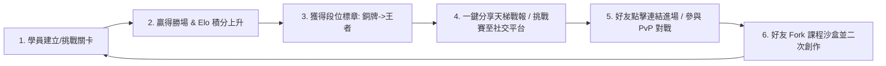
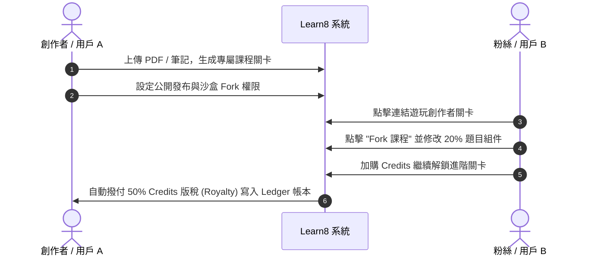

# 📘 白皮書 04：病毒式增長、社交天梯競技與社群營運 (Viral Growth & Community Flywheel)

*專案：Learn8 (AI-Native Adaptive Micro-learning & Gamification Engine)*  
*文檔類型：病毒行銷、社交競技與社群增長白皮書 | 關聯文檔：[docs/market/README.md](./README.md)*

---

## 1. 🚀 病毒式增長飛輪 (Viral Flywheel) 核心架構

當前獲客成本 (CAC) 日益高昂，全新的 AI 產品若單靠付費廣告（Paid Ads）極易在短期內耗盡資金。  
根據 [Duolingo Product-Led Growth 案例](https://www.duolingo.com/) 與 [a16z Viral Loop 觀點](https://a16z.com/)，Learn8 必須將「社交與競技」直接融入產品核心邏輯中。



---

## 2. ⚔️ Elo 天梯競技場 (PvP Arena) 設計細節

### 2.1 Elo 積分匹配演算法 (Matchmaking Mechanics)
Learn8 的競技場基於 chess.com 及 League of Legends 採用的 Elo 標準評分系統：

$$\Delta R = K \times (S - E)$$

- $\Delta R$：對戰後積分變動。
- $K$：對戰權重因子（新進用戶 $K=32$，高階玩家 $K=16$）。
- $S$：對戰結果（獲勝 $S=1$，平手 $S=0.5$，戰敗 $S=0$）。
- $E$：期望勝率 $E = \frac{1}{1 + 10^{(R_{opponent} - R_{user}) / 400}}$。

### 2.2 競技場 3 大增長激勵機制
1. **即時 PvP 搶答 (WebSockets Real-time Arena)**：
   - 兩名學員實時連線，回答同一個 YAML 動態生成的知識關卡題目。
   - 不僅比拼正確率，更比拼「作答速度與費曼表達嚴謹度」。
2. **段位與聯賽賽季 (Seasonal Ladder)**：
   - 設立 6 大段位：青銅 ➔ 白銀 ➔ 黃金 ➔ 鑽石 ➔ 大師 ➔ 神話王者。
   - 每週天梯結算，前 10% 用戶獲得專屬「音色頭銜」與大量的 XP/Credits 獎勵。
3. **賽事戰報一鍵圖卡 (Shareable Battle Card)**：
   - 完賽後自動生成極具視覺衝擊力的炫耀圖卡（例如：「我在 Python 高階對戰中擊敗了 98% 的工程師！」），一鍵分享至 Instagram Story、X (Twitter)、LinkedIn。

---

## 3. 🔄 沙盒課程 Fork 與創作者分潤生態 (Sandbox Course Forking & Royalty)

Learn8 允許用戶與創作者將任何課程進行「沙盒 Fork (Sandbox Forking)」：



### 創作者飛輪 (Creator Flywheel) 的威力
- 創作者主動在其社群（YouTube / Substack / Discord）推廣 Learn8 連結，成為免費的獲客渠道 (Organic Acquisition Channel)。
- 每位創作者平均可為 Learn8 帶來 **50 - 500 名新用戶**。

---

## 4. 📊 病毒係數 (K-Factor) 算式與實驗指標

病毒係數算式：  
$$K = i \times c$$

- $i$：每位用戶發出的對戰邀請或課程分享數量。
- $c$：每位受邀者點擊並註冊 Learn8 的轉化率。

```
[K-Factor 增長情境模擬]
 ├── 現狀基礎 (Baseline) : i = 2.0, c = 12% ──► K = 0.24 (線性增長)
 ├── 優化社交戰報圖卡    : i = 3.5, c = 15% ──► K = 0.52 (高速增長)
 └── 觸發賽事聯賽 + Fork : i = 5.0, c = 22% ──► K = 1.10 (指數級病毒爆發 🚀)
```

---

## 5. 🎯 社群營運 0 到 1 落地腳本 (Community Execution)

### 5.1 Discord 與 Reddit 營運劇本
1. **建立官方 Discord 伺服器**：
   - 設立 `#elo-leaderboard`（每日天梯戰報自動播報）、`#feynman-challenges`（每週費曼解題大賽）與 `#course-forks`（創作者分享區）。
2. **Reddit 定點爆破 (Subreddit Takeover)**：
   - 在 `r/rust`, `r/MachineLearning`, `r/AWS`, `r/pmp` 定期發布「免費社群對戰關卡」。
   - 舉辦「Subreddit 專屬競技聯賽」，成功轉化 Reddit 高品質技術用戶。

---

## 🔗 外部參考資料
- [Duolingo Growth Case Study by GrowthHackers](https://growthhackers.com/)
- [a16z: Viral Loops and Network Effects](https://a16z.com/)
- [Reforge: Product-Led Growth & Virality Metrics](https://www.reforge.com/)
