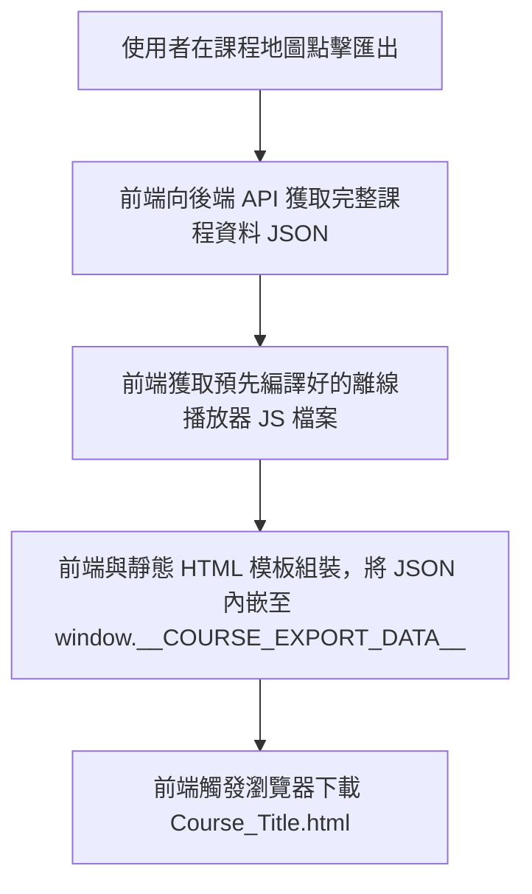

# 計劃 - 課程互動式 HTML 離線匯出功能

本計劃旨在設計並實作「將課程匯出為單一、具備完整互動能力、且可離線運行的 HTML 檔案」之功能。匯出的網頁將包含 winding path 課程地圖（可點選互動）以及與目前線上應用完全一致的課堂播放器（支援所有複雜互動式元件，不進行功能降級）。

---

## 1. 架構設計

為了在離線環境下**不降級地運行所有複雜關卡**（如圍棋棋盤、堆積排序模擬器、甘特圖邏輯排程器等），我們將採用 **編譯型單一 HTML SPA (Bundled Single-Page Application)** 的方案：

1. **前端編譯 (Build-time)**：
   * 在前端新增一個獨立的編譯進入點 `frontend/src/offline/`，僅引入必要的 React 元件與地圖。
   * 使用編譯工具（如 `esbuild`）將這些 React 元件、Zustand 狀態管理、以及相關依賴打包成一個單一的 JavaScript 檔案 `offline_player.js`，並存放在後端的靜態目錄下。
   * **按需打包 (Tree Shaking)**：編譯器會從 `src/offline/index.tsx` 開始追蹤依賴關係，**只有被引用且實際用到的元件與函式庫會被打包進去**，其餘主應用的無關程式碼（如創作者中心、後台管理、個人設定等）將會被自動排除，確保打包體積極小化。
2. **數據整合與下載 (Runtime)**：
   * 後端提供 API `GET /courses/{course_id}/export-data` 整合大綱與所有關卡 stages 內容。
   * 前端將下載的靜態模板、`offline_player.js` 的內容與課程 JSON 數據組裝成一個獨立的 `.html` 檔案（所有 JS 與數據皆內嵌在內，無需外部 JS 載入），完成下載。

---

## 2. 核心 UI 佈局與互動設計（同線上原版）

離線網頁將忠實重現目前的雙欄佈局與視覺細節：

* **左側地圖區**：SVG 繪製 winding path，保留 node 的 hover 動效、狀態樣式（Completed / Available / Locked）。
* **右側播放器區**：完全使用與線上版一致的 React 元件渲染器。
  * **元件交互**：如單選題、配對題、費曼學習法等，使用者可離線點擊並答題。
  * **原版互動模擬器**：如 Go Board、Heap Sort、Gantt 等模擬器，其 React 邏輯將被完全編譯進 `offline_player.js` 中，因此離線狀態下使用者仍可操作棋盤放置棋子、拖動滑桿、完成邏輯排程等。
  * **模擬 Action 阻斷**：在離線模式下，答對/答錯時的 Action 僅在本地端更新 React state（例如將關卡進度加一、顯示反饋面板），而不會向後端發送 HTTP 請求（如儲存 Attempt 或觸發 AI 重新生成題目）。

---

## 3. 專案目錄與檔案操作規劃

為了避免污染 Next.js 主要應用的程式碼與依賴關係，我們決定採用**「核心邏輯新建目錄，進入點在既有檔案增補」**的切分方式：

### 前端部分 (Frontend)

1. **新建目錄 `frontend/src/offline/` (隔離的離線模組)**：
   * `src/offline/index.tsx`：離線播放器的 React 進入點，負責將 App 掛載到 HTML DOM 上，並從 `window.__COURSE_EXPORT_DATA__` 讀取資料。
   * `src/offline/OfflineCoursePlayer.tsx`：核心佈局元件，重現雙欄版面。它將引入並複用既有的 React 元件（例如 `src/features/lesson-session/components/LessonStageRenderer.tsx`）。
   * `src/offline/mockActions.ts`：實作一組 Mock 的課堂 Action 邏輯，當元件呼叫 `submitStage` 或 `continueStage` 時，直接在本地更新狀態，不進行 API 調用。
2. **新增編譯指令**：
   * 在 `frontend/package.json` 中新增 `build:offline` 指令，使用 `esbuild` 將 `src/offline/index.tsx` 打包為單一的 `offline_player.js`。藉由 Tree Shaking 機制，有用到哪些元件就只打包哪些。
3. **既有檔案修改**：
   * 在 [CourseMapPageClient.tsx](file:///Users/kaigiii/Coding/Learn8/frontend/src/app/courses/%5BcourseId%5D/CourseMapPageClient.tsx) 與其導覽列中，增補「匯出課程」的按鈕與點擊下載的 logic。

### 後端部分 (Backend)

1. **新建服務與模板**：
   * `backend/app/services/domain/course/export_service.py`：新增此 Service，專門處理大綱與 stages 的 JSON 整合。
   * `backend/app/templates/offline_template.html`：基礎 HTML 模板。
2. **既有檔案修改**：
   * 在 `backend/app/api/v1/endpoints/courses.py` 中，註冊 `GET /courses/{course_id}/export-data` 路由。

---

## 4. 潛在問題與防範機制 (Potential Issues)

1. **圖片與靜態資源破圖**：
   * **狀況**：課程內容可能包含上傳的圖片（例如 AI 繪製的解釋圖）。在物理斷網時打開離線 HTML，相對/絕對路徑的連結會失效。
   * **防範**：預設採用線上連結（有網時顯示）。為解決斷網情況，我們在 `export_service.py` 中預留圖片轉換邏輯：若發現是內部伺服器上傳的圖片連結，將其二進位內容讀取並轉換為 `data:image/...;base64` 格式直接嵌入 JSON 數據。
2. **CDN 依賴（斷網時）**：
   * **狀況**：模板依賴外部的 CSS CDN。在物理斷網時打開，會因為抓不到 CDN 而破版。
   * **防範**：我們在靜態模板 `offline_template.html` 中優先使用 CDN。對於高標準離線需求，可選擇在編譯時將 Tailwind 與 Icons 原始碼以 String 形式一併寫入範本，但會增加 HTML 下載大小。
3. **Zustand / Global State 衝突**：
   * **狀況**：原有元件高度依賴 Zustand 全域 Stores（如 `useLessonSessionStore`、`useAuthStore`）。如果直接在離線版使用這些 Store，它們可能會去嘗試讀取 localStorage 的 Auth token 或發送同步封包。
   * **防範**：在 `src/offline/` 中，我們會建立簡化版的 Context Provider 或 Mock Store 來注入這些元件所需的 props，使元件與真實的狀態管理 Store 解耦。

---

## 5. 驗證與測試計劃

1. **編譯驗證**：
   * 執行 `npm run build:offline`，驗證是否能產出無語法錯誤、壓縮後的 `offline_player.js`。
2. **下載流驗證**：
   * 點擊前端「匯出課程」按鈕，驗證下載的 HTML 是否已正確嵌入 `offline_player.js` 的程式碼與該課程的 JSON 數據。
3. **離線互動測試**：
   * 斷開網路，雙擊打開下載的 HTML。
   * 測試地圖點擊、選擇題點擊反饋、圍棋棋盤操作、堆積排序模擬器操作，確認無任何 console 錯誤且流程可以順暢地在本地進行。
