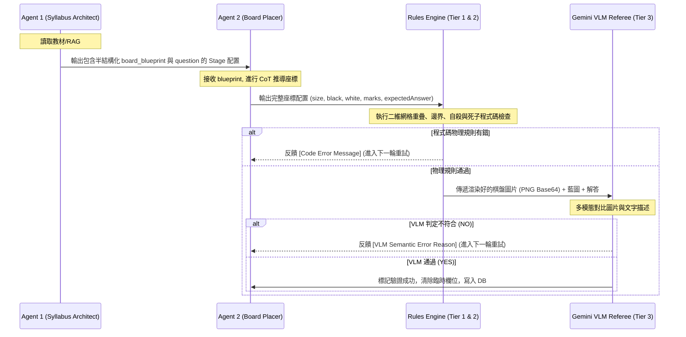

# 圍棋 AI 關卡生成精確度與泛化能力升級計劃書

本計劃書旨在提升 Learn8 專案中圍棋關卡（棋盤配置與答案）生成的正確率，並徹底解決程式碼寫死題型導致系統泛化能力差的痛點。

我們將採用 **Chain of Thought (CoT，思考鏈) 輸出** 與 **多模態視覺審查 (VLM Visual Validation)**，並**拔除程式碼對特定題型的硬編碼判定**，最後對**文字藍圖進行半結構化規範**。

---

## 1. 策略一：採用 Chain of Thought (CoT，思考鏈) 輸出

目前 `BoardPlacerOutput` 直接要求 LLM 輸出最終的 JSON 座標列表。這會迫使 LLM 在單次推論中同時進行「空間推理」與「JSON 格式化」，非常容易產生幻覺或偏移。

### 方案設計
1. **修改 Schema**：在 [BoardPlacerOutput](file:///Users/kaigiii/Coding/Learn8/backend/app/services/domain/learning/lesson_components/go/placer.py#L13-L21) 中加入 `thoughtProcess` 欄位作為首要輸出。
2. **System Prompt 升級**：在 [BOARD_PLACER_SYSTEM_PROMPT](file:///Users/kaigiii/Coding/Learn8/backend/app/services/domain/learning/lesson_components/go/placer.py#L23) 中，強制要求 AI 必須先分析文字藍圖，並在腦中「一步步」定位每顆子與目標點，最後才輸出座標。

### 預期修改

```python
class BoardPlacerOutput(BaseModel):
    thoughtProcess: str = Field(description="二維空間座標逐步推導過程。請依序說明：1. 棋盤大小與藍圖意圖；2. 黑子與白子在網格上的空間相對位置計算；3. 預期落子解答點的位置及其氣數。")
    size: int = Field(description="Board size, usually 5, 9, 13, or 19")
    black: List[str] = Field(description="List of Black stone coordinates, e.g. ['C4', 'E4']")
    white: List[str] = Field(description="List of White stone coordinates, e.g. ['D3']")
    marks: List[str] = Field(description="List of marked coordinates, e.g. ['C4']")
    expectedAnswer: str = Field(description="The correct coordinate answer, e.g. 'C4'")
    acceptableAnswers: List[str] = Field(description="List of all acceptable correct coordinate answers")
    puzzleType: str = Field(description="The type of puzzle")
```

---

## 2. 策略二：多模態視覺審查 (VLM Visual Validation)

LLM 對於 JSON 字串形式的座標不太敏感，但對視覺圖像有極強的比對能力。

### 方案設計
1. **實體渲染 (Programmatic Rendering)**：利用 Python 的 Pillow (PIL) 庫，編寫一個輕量級的渲染函數，將 `BoardPlacerOutput` 轉換為一張清晰的圍棋盤面 `.png` 圖片。
2. **多模態對齊校驗**：在第三層語義校驗中，不只傳入文字，而是將**「渲染出來的棋盤圖片」**與**「原始文字藍圖描述」**一併傳給 Gemini VLM。讓 VLM 作為裁判進行視覺核對。

### 渲染邏輯示意 (PIL 繪製)
```python
import io
from PIL import Image, ImageDraw

def render_go_board(size: int, black: list, white: list, marks: list, answer: str) -> bytes:
    # 創建一個適當大小的畫布 (例如 400x400)
    img_size = 400
    image = Image.new("RGB", (img_size, img_size), color="#DEB887") # 木色背景
    draw = ImageDraw.Draw(image)
    
    # 繪製網格線、棋子、以及標記 (X)
    # ... 依據 size 計算網格間距，繪製直線，並在座標點畫圓形 (黑/白) 與標記
    
    buf = io.BytesIO()
    image.save(buf, format="PNG")
    return buf.getvalue()
```

### VLM 校驗提示詞與輸入格式 (在 [validators.py](file:///Users/kaigiii/Coding/Learn8/backend/app/services/domain/learning/lesson_components/go/validators.py#L66))

```python
from langchain_core.messages import SystemMessage, HumanMessage

# 將渲染好的圖片轉成 Base64 Data URI
b64_image = base64.b64encode(rendered_bytes).decode("utf-8")
data_uri = f"data:image/png;base64,{b64_image}"

messages = [
    SystemMessage(content="你是一位嚴格的圍棋裁判助理。你必須核對渲染出的實體棋盤圖片與題意文字是否完全吻合，並只回答 YES 或 NO (若為 NO 則附加理由)。"),
    HumanMessage(content=[
        {
            "type": "text",
            "text": f"【問題文字】：{question}\n【文字藍圖描述】：{blueprint}\n【預期解答】：{expected_answer}\n請仔細查看附加的實體棋盤圖片，核對黑白棋子擺放是否正確，以及預期解答是否確實能達成題目目的。"
        },
        {
            "type": "image_url",
            "image_url": {"url": data_uri}
        }
    ])
]
reply = await llm_provider.generate_text(messages)
```

---

## 3. 策略三：拔除程式碼硬編碼判定 (提高系統泛化能力)

### 目前問題
在 [evaluators.py](file:///Users/kaigiii/Coding/Learn8/backend/app/services/domain/learning/lesson_components/go/evaluators.py#L69-L91) 中，如果題庫中沒有存入預先寫好的 `valid_answers`，程式會用硬編碼的關鍵字判斷（如出現 `"提"`、`"吃"`、`"連"`、`"斷"`、`"逃"`、`"劫"` 等）並調用 `GoRulesEngine` 的特定方法來動態批改。

這會導致以下痛點：
1. **死活題或手筋題等泛化題型無法批改**：一旦出現不屬於這 6 類關鍵字的互動題型（例如：「請下在死活的要點上」、「請在此處進行征子」），程式碼便無法進行對應的模擬判定。
2. **答非所問**：如果問題文句使用了同義詞（例如：「使黑棋互通」而非「連」），關鍵字判斷會失效。

### 方案設計
* **徹底拔除 [evaluators.py](file:///Users/kaigiii/Coding/Learn8/backend/app/services/domain/learning/lesson_components/go/evaluators.py#L69-L91) 的 fallback 關鍵字批改防線**。
* **改為「嚴格依賴生成期的預存答案」**。因為我們在生成期已經引入了 **3 次重試**、**物理校驗** 以及 **VLM 視覺雙重驗證**，保證了寫入資料庫的 `expectedAnswer` 與 `acceptableAnswers` 達到 100% 正確性。
* 評估 grading 時，直接比對 `stage.config.data["acceptableAnswers"]`。即使未來生成了「雙活」、「死活 vital point」等任何特殊題型，批改器也能完美支持。

---

## 4. 文字藍圖的「半結構化格式化」對比

### Before (完全自由的自然語言)
Agent 1 隨機產出一段文字，可能長這樣：
> "在棋盤的右下角，大約在 9x9 棋盤的 D2 位置有一顆白子，而它的上方 E2 與左方 D3 都已經被黑子擋住了。另外在 C2 還有一顆白子被黑子包圍。黑棋現在只要下在 D1 就可以把那顆白子提起來。請出一道吃子題。"

**痛點**：
- Placer Agent 難以解析複雜的方位詞（"大約在"、"上方"、"左方"）。
- 容易產生座標代稱混淆（"D2 的白子，上方 E2 被黑子擋住" —— 實際上 D2 的上方是 D3，右方才是 E2，LLM 空間定位常有此類低級錯誤）。

### After (半結構化格式化描述)
Agent 1 被要求依據統一規範輸出格式化的 `board_blueprint`，例如：
```yaml
board_size: 9
stone_placements:
  black: [E2, D3, C2]
  white: [D2]
expected_play_coordinate: D1
pedagogical_goal: "黑棋下在 D1，將氣數為 1 的 D2 白子提吃。"
```

或簡約的 ASCII 棋盤描述：
```text
[5x5 Board Blueprint]
. . W . .
. W X W .
. . W . .
Question: 標記點 X 是黑棋的禁入點 (Suicide point)。
```

**優勢**：
- Placer Agent（Agent 2）只需專注於**「將此配置轉換為符合標準規範的完整 JSON」**，減少了閱讀小作文時發生的語意與空間幻覺。
- 將空間定位的職責在 Agent 1（生成大綱）階段就透過嚴格的 Key-Value 結構收攏。

---

## 5. 數據流與上下文傳遞設計 (Context & Data Flow Design)

在整個解耦管道中，資料是利用 `LessonStage.config.data` 進行逐步承接與轉換。以下是三個階段的完整輸入與輸出設計，以確保上下文能正確傳遞。



### 各 AI 階段之輸入與輸出 Payload 規範

#### 1. 傳給 Agent 2 (座標翻譯師) 的 Payload 內容
* **當第一輪生成時**：
  - `question`: 題意文字（例如：「黑棋要如何下子提吃白棋？」）
  - `board_blueprint`: 由 Agent 1 產生的半結構化 YAML/ASCII 配置描述。
  - `playerColor`: 玩家執子顏色（B 或 W）。
* **當校驗失敗重試（第 2~3 輪）時額外加入**：
  - `previous_errors`: 完整累積的歷史校驗錯誤訊息（包含第幾次重試、什麼規則被破壞，例如：`"第 1 次座標生成異常：預期答案座標已落有棋子：C4"` 或 `"第 2 次 AI 語義校驗未通過：圖片中黑棋下在 C3 會自殺，且無法提取白子，不符題意。"`）。

#### 2. 傳給第三層 VLM (裁判助理) 的 Payload 內容
為了讓多模態模型進行最客觀的視覺對比，我們傳遞以下組合內容：
1. **圖片部分**：
   - 使用 Pillow 根據 Agent 2 的座標動態繪製的圍棋盤面 `.png` 圖片，轉換為 `image_url` 的 Base64 資料流。
2. **文字部分 (Context)**：
   - 原始題目藍圖描述 `board_blueprint`（做為對比基準線）。
   - 當前題目的問題 `question` 與解析 `explanation`。
   - 預期正確落子解答 `expectedAnswer`。
   - 玩家持子顏色 `playerColor`。

---

## 6. 錯誤校正與重試回饋機制 (Error Correction & Feedback Loop)

系統設計了兩層校正迴圈，第一層在 Agent 2 層級（快速重試座標），第二層在 Agent 1 層級（全單元回滾）。

### 第一層：Agent 2 的校正迴圈 (最多 3 次)

當任何一層校驗（物理規則、自殺規則、AI 語義校核）報錯時，該錯誤訊息會被捕獲，並串接在下一次 Request 的 Prompt 尾端。

#### 迭代修正與漸進校驗機制 ("Generate-Verify-Feedback" Loop)

這個迴圈是一個**有狀態的、多輪漸進校驗與修正過程**。每一輪的「檢查」結果不對，都會引導下一次的「修正」，具體步驟如下：

```
[第一輪] Placer (Agent 2) 產出座標
         │
         ▼
[第一輪校驗] 發現物理錯誤 (例如：黑白棋重疊於 C4)
         │
         ▼ (反饋錯誤：黑白棋重疊於 C4)
[第二輪] Placer (Agent 2) 接收前次結果與反饋，修正重疊 (移開白子至 D3)
         │
         ▼
[第二輪校驗] 物理通過，但 VLM 發現語義錯誤 (例如：預期解答 C3 會自殺)
         │
         ▼ (累計反饋：C4已修正；但 C3 會自殺且無法提子)
[第三輪] Placer (Agent 2) 再次修正座標配置或解答點
         │
         ▼
[第三輪校驗] 物理與 VLM 皆通過 ── 寫入 DB
         (若依然失敗 ── 觸發第二層 Agent 1 藍圖重新設計)
```

1. **第 1 次生成 (Initial Try)**：
   - Agent 2 根據文字藍圖翻譯出初始座標 JSON。
   - 執行檢測，假設偵測到錯誤：`"黑子與白子座標重疊：['C4']"`。
2. **第 1 次修正檢測 (1st Correction-Verify)**：
   - 系統將此錯誤寫入 `previous_errors` 串接在 prompt。
   - Agent 2 收到錯誤，在腦中修正此問題，例如將白子移動到 D3。
   - 重新校驗：物理通過了，但傳遞給第三層 VLM 裁判時，VLM 判定解答座標 C3 會造成自殺，回傳 `"第三層 AI 語義校驗未通過：黑棋落子在 C3 會自殺且無法提子。"`
3. **第 2 次修正檢測 (2nd Correction-Verify)**：
   - 系統將累積的歷史錯誤（重疊已修復、但 C3 自殺問題待修）再次反饋給 Agent 2。
   - Agent 2 在第三次嘗試中重新調整白子位置或將正確答案修改為 `C4`。
   - 校驗器進行最終檢驗，通過則儲存；若此輪（第 3 次嘗試）依然失敗，則拋出異常回滾至 Agent 1。

#### 錯誤反饋 Prompt 模板實作設計
```python
user_content = f"【問題要求】：{data.get('question')}\n【文字藍圖描述】：{blueprint}\n"
if placer_errors:
    feedback_str = "\n".join([f"- Attempt {i+1} Failed: {err}" for i, err in enumerate(placer_errors)])
    user_content += (
        f"\n⚠️【前次生成錯誤報告】:\n{feedback_str}\n\n"
        f"請仔細閱讀以上錯誤報告，避免在本次生成中重複相同的座標定位錯誤。"
        f"請修正 black, white 棋子擺放，或重新評估 expectedAnswer 座標。"
    )
```

#### 物理規則自動修正 (對 numeric 題型)
- 對於氣數（`liberties`）與地盤（`territory`），規則引擎是 100% 精準的。
- 如果 Placer 產生的 `expectedAnswer` 與 Rules Engine 計算的不一致，程式會**自動補正答案**，直接更新 `data["expectedAnswer"] = str(computed)`。這不視為錯誤，能直接通過校驗。

### 第二層：Agent 1 藍圖回滾 (最多 1 次)
如果 Agent 2 在 3 次重試後依然無法正確將藍圖翻譯成合法座標（通常意味著 Agent 1 設計的藍圖本身存在邏輯矛盾，例如「在 5x5 棋盤上擺放 30 顆棋子」），則：
1. `place_go_board` 會拋出 `ValueError`。
2. 該異常會被外層的課程生成控制器擷取。
3. 控制器將要求 Agent 1 **重構該 Node 的整個關卡藍圖**，提供一個全新的 `board_blueprint`。
4. 拿到新藍圖後，重設 Agent 2 的 3 次計數器，重新執行翻譯與校驗管道。

---

## 7. 正確解答 (expectedAnswer) 的生成職責劃分

在目前的雙代理人（Syllabus/Lesson Architect $\rightarrow$ Board Placer）架構中，正確解答有明確的生成與流轉階段：

### 1. 規劃階段：Agent 1 (Syllabus/Lesson Architect)
- **要求**：在 `board_blueprint` 欄位中，必須包含正確答案與目標下法的文字說明（例如：「...目標是透過下在 D1 來提吃氣數只剩 1 氣的 D2 白子...」）。
- **限制**：**沒有/禁止**要求 Agent 1 直接輸出 JSON 格式的 `expectedAnswer` 欄位（因為其職責是教學大綱與藍圖規劃，強制輸出實體 JSON 座標會分散其專注度並提高出錯率）。

### 2. 座標翻譯階段：Agent 2 (Board Placer)
- **要求**：**有**，明確要求 Agent 2 將 Agent 1 設計的 `board_blueprint` 解析，並精確翻譯成座標形式的正確答案，寫入 `expectedAnswer` 與 `acceptableAnswers` 欄位。
- **好處**：這樣能將「教學藍圖設計」與「實體座標計算與規則驗證」完全解耦，由專門定位的 Placer 來處理座標轉換並確保符合規則。

---

## 8. 設計檢視與防錯設計 (Defensive Design & Flaw Mitigation)

為確保新架構在實際開發與歷史資料相容性上完整無缺，我們針對可能出現的細節死角設計了以下防禦措施：

### 1. Pydantic 欄位定義順序對 CoT 思考順序的保證
- **潛在缺陷**：大語言模型使用 JSON Structured Mode 時，輸出順序會與 Pydantic 類別中的欄位定義順序一致。若 `thoughtProcess` 定義在後半部，AI 將「先輸出座標、再輸出推理」，導致 CoT 失去前置思考的作用。
- **防錯措施**：我們必須確保 `thoughtProcess` 在類別定義中為 **第一個宣告的欄位**，強制 LLM 先在 Token 序列中輸出文字思考鏈，再產出座標數值。

### 2. 棋盤渲染圖片必須繪製座標標籤 (Coordinate Grid Labels)
- **潛在缺陷**：如果 Pillow 渲染出的圖片只是一個棋盤加棋子，沒有標記邊緣的欄位英文字母（A-T）與列數（1-N），Gemini VLM 裁判將無法從視覺上對齊正確解答點（例如分不清到底下在 C4 還是 D4）。
- **防錯措施**：在 Pillow 繪圖腳本中，**畫布邊緣必須繪製出明顯的座標邊框與文字標籤**，使得 VLM 判讀時能像讀實體圍棋書一樣，有準確的參照物。

### 3. 多模態視覺校驗 (VLM) 的延遲與 Token 成本優化
- **潛在缺陷**：每次重試都呼叫 Gemini VLM 會造成 API 回傳延遲顯著增加，並產生大量多模態 Token 的費用支出。
- **防錯措施**：實作短路求值 (Short-circuit evaluation)。**只有當第一層（物理）與第二層（規則狀態）的 Python 程式碼快速檢查 100% 通過時，才會觸發第三層 VLM 校驗**。若前兩層已有報錯，直接快速失敗（Fail-fast）並引導 Agent 2 重試。

### 4. 歷史課程資料相容性防線 (Backward Compatibility)
- **潛在缺陷**：移除 `evaluators.py` 寫死的關鍵字 fallback 判斷後，若資料庫內存在未完整寫入 `acceptableAnswers` 的歷史關卡，可能會導致學生回答正確卻被判錯。
- **防錯措施**：在 [evaluators.py](file:///Users/kaigiii/Coding/Learn8/backend/app/services/domain/learning/lesson_components/go/evaluators.py#L55) 的讀取邏輯中加上相容防禦：
  ```python
  # 如果資料庫中的 acceptableAnswers 為空，自動退回將唯一的 expectedAnswer 作為 valid_answers 的唯一值
  if not valid_answers and expected_answer:
      valid_answers = {str(expected_answer).replace(" ", "").upper()}
  ```
  如此能保障歷史題目批改完全不受重構影響。


